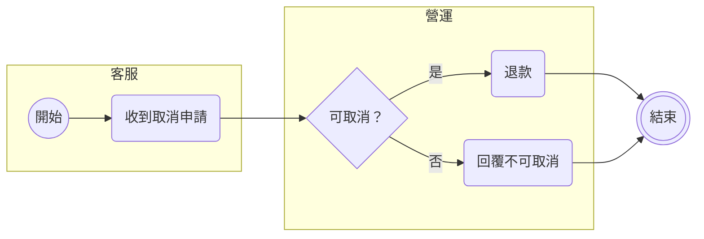
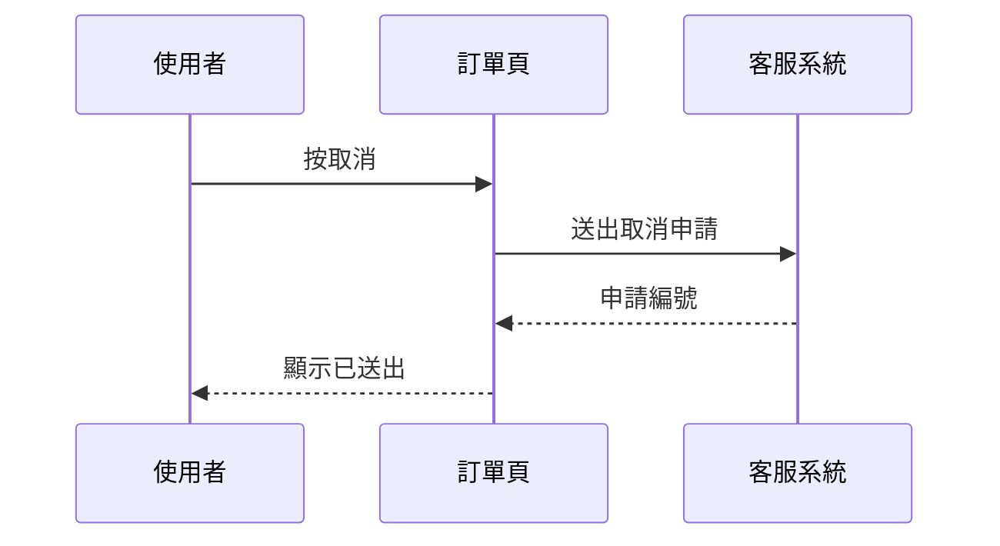
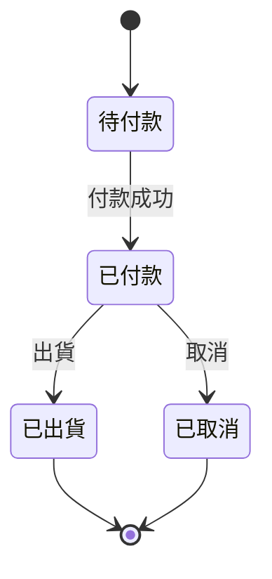

# 開發計畫（PRD）標準模板

這份模板給 LLM 之後寫開發計畫用。
讀者是需求方：PM 與 user，不是工程師。他們要在 5 分鐘內看懂、願意同意方案、能在列出的選項之間做決定。
工程細節放最後一節附錄給 RD。正文裡任何一句話，問一次「需求方讀了會不會想跳過」，會就搬去附錄或刪掉。

## 怎麼用這份模板

- 正文十節，順序固定，標題照抄。沒內容的節寫一行「無」並說明為什麼，不刪節。
- 每節下面有四樣東西：這節回答讀者的什麼問題、長度上限、寫法範例。範例是填空式，`〈 〉` 裡換成實際內容。
- 長度上限是上限，不是目標。一節三行講得完就三行。
- 「需要需求方決定的事」那一節是整份文件存在的理由。其他節都是為了讓讀者有足夠資訊做那幾題。
- 先寫摘要的草稿，寫完全文再回頭改摘要，確認它跟正文一致。

---

## 0. 文件頭

**回答的問題**：這是哪件事的計畫、現在走到哪、有問題找誰。

**長度上限**：一張表，五列以內。

**寫法範例**：

| 項目 | 內容 |
|---|---|
| 計畫名稱 | 〈一句話，動詞開頭，例：讓訂單頁的取消按鈕只在可取消時出現〉 |
| 狀態 | 〈草稿／待需求方決定／已同意／施工中／已上線〉 |
| 需求方 | 〈PM 姓名、user 代表姓名〉 |
| 負責 RD | 〈姓名〉 |
| 最後更新 | 〈YYYY-MM-DD〉 |

---

## 1. 一句話摘要

**回答的問題**：這份文件要我做什麼決定？做了之後誰的什麼問題會消失、什麼時候會看到？

**長度上限**：三句話，加一行「要你決定的事」。全部放得進手機一個螢幕。

**寫法範例**：

> 〈誰〉現在〈遇到什麼問題〉，每〈天／週〉發生〈次數或量〉。
> 我們打算〈方案一句話〉，預計搭〈YYYY-MM-DD〉那班上線。
> **要你決定的事**：〈題數〉題，在第 5 節，最晚〈YYYY-MM-DD〉前回覆，否則〈會發生什麼，例：往後推一班〉。

這一段寫完要通過一個測試：讀者只讀這段就知道要不要往下看、以及看完要回答什麼。
不寫「本文件旨在」「以下說明」這類開場。

---

## 2. 背景與現況

**回答的問題**：現在長什麼樣、哪裡壞了、我們怎麼知道的？

**長度上限**：兩段，每段四行以內。一張現況截圖或一張現況流程圖。

**寫法範例**：

> 圖 1：〈現況截圖，標出問題發生的位置〉
> 圖說：〈一句話，例：取消按鈕在已出貨的訂單上仍然可以按，按了會跳錯誤〉
>
> 現在〈使用者〉在〈哪個畫面／步驟〉會〈遇到什麼〉。
> 從〈YYYY-MM-DD〉到〈YYYY-MM-DD〉，〈量測到的數字〉，來源是〈客服單／log／GA，寫名字不寫查詢語法〉。
>
> 這件事〈為什麼現在要做〉：〈一句話，例：11 月促銷會把這個量放大三倍〉。

數字一定要有來源與期間。沒有數字就寫「沒有量測，只有〈幾〉則回報」，不要用形容詞補。
截圖存放位置寫在附錄 A，正文只放圖本身與圖說。

---

## 3. 目標與不做的事

**回答的問題**：做完之後哪些事會變、哪些事刻意不會變？

**長度上限**：目標三條以內，不做的事三條以內。每條一行。

**寫法範例**：

> **目標**
> 1. 〈使用者〉可以〈做到什麼〉，不再〈遇到什麼〉。
> 2. 〈可量的改變，例：取消失敗的客服單從每週 40 則降到 5 則以下〉。
>
> **這一版不做的事**
> 1. 〈本來可以一起做、但這次刻意不做的事〉——因為〈一句理由〉。
> 2. 〈同上〉。

「不做的事」寫的是本來合理可以做、這次選擇不做的事，不是「系統不會當機」這種反面敘述。
每條帶理由，讀者才判斷得了這個取捨他接不接受。要是有一條讀者可能不接受，它應該出現在第 5 節讓他決定。

---

## 4. 方案

**回答的問題**：我們打算怎麼做？做完之後使用者會經歷什麼？

**長度上限**：每個方案一張流程圖加兩段文字，每段四行以內。方案數量一到三個，超過三個先自己淘汰。

**寫法規則**：
- 圖先文後。圖放在它解釋的段落之前，圖下一句圖說。
- 流程圖畫的是使用者看得到的步驟，不畫系統內部呼叫。節點用使用者會講的詞（「按取消」「看到確認視窗」），不用元件名或 API 名。
- 只有一個方案時，說出為什麼沒有別的選擇；兩個以上時，每個方案的文字結構相同，讀者才比得了。
- 推薦哪一個寫在這一節最後一行，理由一句。選擇本身放第 5 節讓讀者決定。

**寫法範例**：

> ### 方案 A：〈名字，用結果命名，例：按鈕只在可取消時出現〉
>
> ```mermaid
> flowchart LR
>   s([〈使用者進到哪一頁〉]) --> b{〈系統判斷什麼〉}
>   b -- 〈條件一〉 --> c[〈使用者看到什麼〉]
>   b -- 〈條件二〉 --> d[〈使用者看到什麼〉]
>   c --> e([結束])
>   d --> e
> ```
> 圖 2：〈一句話，例：已出貨的訂單不再顯示取消按鈕，改顯示聯絡客服〉
>
> 〈使用者〉在〈哪一步〉會〈看到或做什麼〉。跟現在的差別是〈一句〉。
>
> 代價：〈需求方會感受到的代價，例：要多等一班、某個舊功能要收掉、某類使用者會多一步〉。
>
> ### 方案 B：〈名字〉
> （結構同上）
>
> **建議**：方案〈A〉，因為〈一句話，對準第 3 節的目標〉。

用哪一種圖、符號長什麼樣，照〈流程圖〉那一節的對照表選。跨角色的流程用泳道圖，不硬塞進一張一般流程圖。
方案文字裡不出現 repo 名、檔名、API 路徑、資料表；那些在附錄 B。

---

## 5. 需要需求方決定的事

**回答的問題**：哪幾題只有你能回答？每個選項要付什麼代價？你不回答會怎樣？

**長度上限**：三題以內。每題一張表，表格五欄以內，加一行建議、一行不決定的後果。

**寫法規則**：
- 只放需求方才答得出來的題：要哪一版、什麼時候要、真正想解決什麼、拿什麼算成功。工程上推得出答案的不放，自己決定寫進方案。
- 每個選項的代價寫成需求方感受得到的東西（時間、使用者會多一步、某功能沒了），不寫技術代價。
- 每題都要有建議。沒有建議等於要讀者替你做功課。
- 「不決定會怎樣」是真的會發生的事（往後推一班、照建議做、擱置），不是威脅。

**寫法範例**：

> ### 題 1：〈一句問句，例：已出貨的訂單要不要保留「聯絡客服」入口？〉
>
> | 選項 | 使用者會經歷什麼 | 代價 | 什麼時候能上 |
> |---|---|---|---|
> | A 〈名字〉 | 〈一句〉 | 〈一句〉 | 〈班次日期〉 |
> | B 〈名字〉 | 〈一句〉 | 〈一句〉 | 〈班次日期〉 |
>
> **建議**：〈A〉，因為〈一句〉。
> **〈YYYY-MM-DD〉前沒有決定**：〈會發生什麼，例：照建議 A 做；或：這題擱置，整案往後推一班〉。

這一節有幾題，第 1 節摘要就寫幾題，數字要一致。

---

## 6. 里程碑與班次

**回答的問題**：什麼時候會看到什麼？哪一天前要做完什麼才趕得上？

**長度上限**：一張甘特圖，八列以內；圖下一張「需要需求方做什麼」的表，三列以內。

**寫法範例**：

> ```mermaid
> gantt
>   dateFormat YYYY-MM-DD
>   section 決定
>   需求方回覆第 5 節        :d1, 2026-01-05, 3d
>   section 施工
>   施工                     :b1, after d1, 10d
>   測試環境試用             :t1, after b1, 5d
>   section 上線
>   封版                     :milestone, f1, 2026-01-30, 0d
>   上線（範例班次）         :milestone, r1, 2026-02-05, 0d
>   上線後驗收               :v1, after r1, 7d
> ```
> （日期與天數是範例，換成實際的班次日期與估的天數；Mermaid 只吃真的日期，留 〈 〉 會畫不出來。）
>
> 圖 3：〈一句話，例：需求方 〈日期〉 前回覆，就趕得上 〈班次日期〉 那班〉
>
> | 日期 | 需要需求方做什麼 |
> |---|---|
> | 〈YYYY-MM-DD〉 | 回覆第 5 節的決定 |
> | 〈YYYY-MM-DD〉 | 在〈哪個環境〉試用並回報 |

圖怎麼畫、欄位要哪些，照〈時間軸〉那一節。
班次是固定的，日期寫實際的班次日期，不寫「約兩週」。
錯過封版就是下一班，圖上要看得出來哪一天是封版。

---

## 7. 成功怎麼量

**回答的問題**：上線之後怎麼知道問題真的消失了？看哪個數字、什麼時候看？

**長度上限**：一個主指標，最多兩個副指標。一張表。

**寫法範例**：

> | 指標 | 現在 | 目標 | 什麼時候量 | 從哪裡看 |
> |---|---|---|---|---|
> | 〈主指標，例：取消失敗的客服單〉 | 〈每週 40 則〉 | 〈每週 5 則以下〉 | 上線後第〈2〉週 | 〈客服系統的哪個報表〉 |
> | 〈副指標〉 | 〈現值〉 | 〈目標值〉 | 〈時間〉 | 〈來源〉 |

主指標要對得上第 2 節量到的那個數字，第 3 節的目標要用同一個數字講。
沒有現值就寫「沒有基線，上線後先量兩週當基線」，不寫目標值。
「從哪裡看」寫需求方自己打得開的東西，打不開的放附錄。

---

## 8. 風險與回滾

**回答的問題**：可能會出什麼事？出事的時候使用者會看到什麼、我們多快能復原？

**長度上限**：風險三條以內，每條一行；回滾一段四行以內。

**寫法範例**：

> **風險**
> 1. 〈會發生什麼〉→ 使用者會〈看到什麼〉→ 我們會〈怎麼處理〉。
> 2. 〈同上〉。
>
> **回滾**
> 上線後發現〈什麼情況〉就回滾。回滾由〈誰〉決定，〈多久〉內完成，使用者會回到〈現在的樣子〉。
> 回滾〈會／不會〉影響已經〈做了什麼的使用者，例：上線後才下的訂單〉。

風險寫使用者看得到的後果，不寫「可能有 bug」。
回滾那段要回答「要不要先問需求方」：要就寫誰、怎麼聯絡；不要就寫 RD 自己判斷的條件。

---

## 9. 開放問題

**回答的問題**：還有哪些事沒答案？誰在找答案、什麼時候前要有？

**長度上限**：一張表，五列以內。

**寫法範例**：

> | 問題 | 誰負責找答案 | 什麼時候前要有 | 沒答案的話 |
> |---|---|---|---|
> | 〈一句問句〉 | 〈姓名，RD 側的寫 RD〉 | 〈施工前／封版前／上線後可補〉 | 〈先照什麼假設做〉 |

這一節跟第 5 節的差別：第 5 節是需求方要決定的，這一節是還在查的。
一題要是查完才發現需求方要選，查完就搬到第 5 節。
每題都有負責人，沒有負責人的題刪掉。

---

## 10. 附錄（RD 側）

**回答的問題**：RD 接手要去哪裡、改什麼、多大、根據是什麼？

**長度上限**：不限，但正文不引用附錄的細節；附錄分四個小節，用 A、B、C、D 編號。

**寫法範例**：

> ### 附錄 A：現況證據
> - 截圖存放：〈路徑或連結〉
> - 量測命令或查詢：〈原文〉；期間〈起迄〉；結果〈數字〉
>
> ### 附錄 B：改哪裡
> | repo | 改動 | 相關 API／資料 |
> |---|---|---|
> | 〈repo 名〉 | 〈改什麼〉 | 〈路徑或表名〉 |
>
> ### 附錄 C：估點與前置
> - 方案 A：〈點數〉；前置：〈要先做什麼〉
> - 方案 B：〈點數〉；前置：〈同上〉
>
> ### 附錄 D：出處
> - 〈每一個正文裡的數字與主張對應的來源：ticket、log 查詢、知識庫節點、會議紀錄〉

正文裡出現過的每個數字都要在附錄 D 找得到出處。
檔名、行號、命令、查詢語法只出現在這裡。

---

## 排版

排版要讓讀者一塊接一塊讀下去，不看到一整片字就跳過。下面每條規則後面的括號是出處代號，對照在本節最後。

**切塊**

1. 一個區塊講一件事，區塊之間空一行。看起來黏在一起的兩件事，拆成兩塊。（M、R）
2. 一段不超過四行，中心句放第一句。超過就是兩件事，拆開或刪掉一件。（R）
3. 單句 20 字以內最好，40 字以上不用。（R）
4. 每節之間空一行；節內的圖、表、段落之間也空一行。（M）

**標題**

5. 標題最多三層：文件標題、節標題、方案或題目標題。不開第四層，並列的細項用列表。（R、G）
6. 不跳層：節標題底下才出現方案標題。（R、G）
7. 標題底下先接一句話，再接下一層標題或表，不讓兩個標題直接相連。（G）
8. 下一層標題不重複上一層的字。同一層只有一個標題時，併回上一層。（R）

**列表與表格**

9. 有先後順序的用編號列表，沒有順序的用項目符號列表。只有一項不成列表，寫成一句。（G）
10. 每一項有三個以上屬性要比較時用表格；屬性只有一兩個時用列表。（G）
11. 表格前面一句話說出這張表要人看什麼。表格不超過五欄，不合併儲存格。（G）

**圖**

12. 圖放在它解釋的段落之前，圖下一行一句圖說，說出這張圖要人看到什麼。（本）
13. 每個大節至少一張圖或表，讓讀者有地方停。（M）

**字與符號**

14. 中文與英文、中文與數字之間留一個半形空格；數字與單位之間也留。（S）
15. 中文用全形標點，數字用半形；標點不重複。（S）
16. 專有名詞用正確大小寫，不用不通行的縮寫。（S）
17. 粗體只標一句裡最要緊的幾個字，一段最多一處。（M）

**內容**

18. 正文不放檔名、行號、命令、查詢語法、API 路徑、資料表名，這些全部進附錄。（本）
19. 同一件事只講一次。摘要講過的，正文用一句「見第 N 節」帶過。（本）
20. 數字帶單位與期間，日期寫 YYYY-MM-DD，不寫「約」「大概」「近期」。（本）
21. 用使用者會講的詞：「按鈕」不叫「元件」。（本）
22. 連結要能點：ticket、PR、報表第一次出現都帶完整 URL，連結文字說出連過去是什麼。（G）
23. 摘要一個螢幕讀完，正文五分鐘讀完。正文（第 0 到 9 節）超過兩頁 A4 就要砍。（本）

出處代號：
M＝邱韜誠〈Medium 中文排版建議：區塊式排版法〉（2017），作者在文末自己註明是個人偏好、沒有嚴謹驗證，所以本模板只取它跟另外幾份一致的部分；
R＝阮一峰《中文技術文件寫作規範》的〈標題〉〈文本〉〈段落〉；
S＝《中文文案排版指北》；
G＝Google developer documentation style guide 的 headings、lists、tables、link text；
本＝本模板自訂，理由在各節的寫法規則裡。連結見 prd-sources.md。

## 流程圖

先問這張圖要回答什麼，再照下表選記法。一張圖只用一種記法。

| 要畫的是 | 用這種圖 | 符號規範 |
|---|---|---|
| 一件事的步驟與判斷 | 一般流程圖 | ISO 5807 |
| 好幾個角色各做哪一步、怎麼交棒 | 泳道圖 | BPMN 2.0 的 pool 與 lane |
| 系統或角色之間依時間先後傳了什麼 | 循序圖 | UML 2.5 sequence diagram |
| 一樣東西有哪些狀態、什麼事件讓它變 | 狀態圖 | UML 2.5 state machine |

**一般流程圖（ISO 5807）**：開始與結束用圓角框，處理用矩形，判斷用菱形、出口標條件，資料（輸入或輸出）用平行四邊形。箭頭由上而下或由左而右。


**泳道圖（BPMN 2.0）**：一個角色一條泳道，泳道標角色名；開始事件用細圓、結束事件用粗圓、工作用圓角框、閘道用菱形。交棒的箭頭跨泳道。



Mermaid 沒有 BPMN 記法，用一個 subgraph 當一條泳道。BPMN 的完整符號要用 BPMN 工具（例如 bpmn.io）畫成圖片放進來。

**循序圖（UML sequence diagram）**：參與者在上方排成一列，生命線往下；實線箭頭是呼叫，虛線箭頭是回應，時間由上往下。



**狀態圖（UML state machine）**：狀態用圓角框，實心圓是初始狀態，箭頭標觸發的事件。



**在哪裡畫得出來**：

- Markdown 能渲染 Mermaid 的地方（GitHub、GitLab、Notion 等），直接用上面的 Mermaid 寫法。
- Claude Docs 的圖是 SVG widget，四種記法都能照表上的符號畫：圓角框、矩形、菱形、平行四邊形各一種形狀；泳道是並排的長條框，每條標角色名。
- 兩邊都畫不出的地方，用畫圖工具輸出圖片，符號照表上規範。

## 時間軸

時間表一律用甘特圖：一列一個階段，橫軸是日期，長條從開始畫到結束，里程碑畫成菱形。

每一列要有這幾格：

| 欄位 | 寫什麼 |
|---|---|
| 階段 | 用需求方會講的詞，例：施工、測試環境試用、上線後驗收 |
| 開始與結束 | 實際日期 YYYY-MM-DD；還沒定的寫「排後續」，不估一個日期 |
| 依賴 | 要等哪一列做完才開始，Mermaid 寫 after |
| 里程碑 | 封版日與班次日期，長度 0 天 |

需求方要配合的那幾天（回覆、試用）在圖下另列一張表，不只藏在長條裡。

**在哪裡畫得出來**：

- Markdown 能渲染 Mermaid 的地方，用第 6 節範例的 gantt 寫法。
- Claude Docs 用 timeline 圖：起訖日期放在資料列裡，長條與菱形從資料列畫出來，日期字跟著資料走；班次日期用強調色加一條虛線。
- 甘特圖沒有 ISO 標準。欄位取自 PMBOK 的時程表示法：長條代表活動，里程碑是長度為零的時間點。

## 不做的事（寫這份文件的時候）

1. **不出題給讀者寫作業。** 「請需求方評估 X 的影響」「是否需要 Y 請確認」這類句子不寫。要讀者決定的事，寫成第 5 節的格式：選項、代價、建議、不決定會怎樣。資訊不夠讓他選，是寫的人要去補，不是讀者要去查。
2. **不印「甲方／乙方」「業主／承包」「需求單位／開發單位」這種詞。** 寫名字或角色：「PM」「user」「RD」「〈姓名〉」。立場是視角，不是稱謂。
3. **不把爭議丟給第三者。** 「這點要請主管裁示」「視公司政策而定」不寫。寫的人提方案與建議，讀者在選項間決定；兩邊都決定不了的事，寫進第 9 節，寫上誰負責去問、什麼時候前問到。
4. **不列等價選項讓人選。** 每題都有建議。真的沒有建議，就是寫的人還沒想完。
5. **不用技術代價說服讀者。** 「這樣比較好維護」「架構比較乾淨」不是需求方感受得到的代價，換成時間、功能、使用者會多幾步。
6. **不寫過程。** 探索了幾個方向、試了幾次、跟誰討論過，不進正文。讀者要的是結論與根據。
7. **不用形容詞代替數字。** 「很多使用者」「嚴重影響」換成量到的數字，沒量到就寫「沒量到」。
8. **不替讀者決定他的事。** 第 5 節該有的題不因為「大概會選 A」就自己寫死進方案。推得出答案的自己決定；只有需求方答得出的，一定要問。
