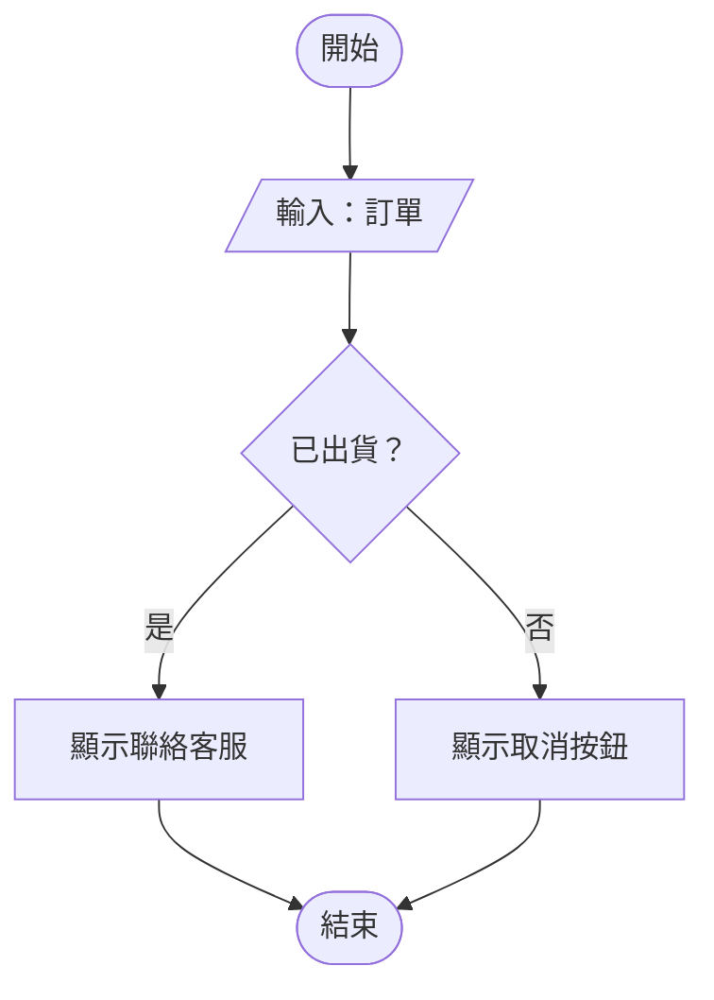
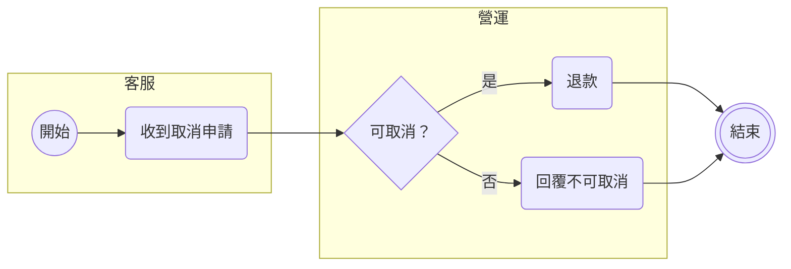
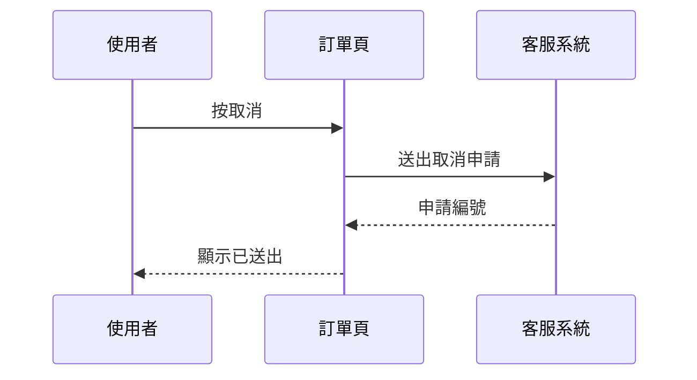
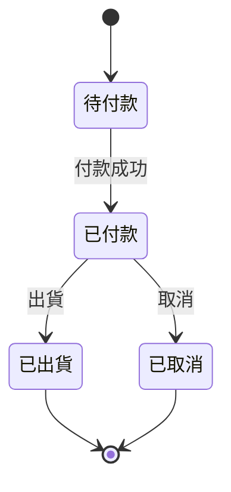

# 開發計畫（PRD）標準模板

這份模板給 LLM 寫開發計畫用。

一份開發計畫有三種讀者：PM、使用者代表（每天操作這個功能的人）、RD。
PM 與使用者代表要在五分鐘內看懂這件事怎麼做、什麼時候上、他們要配合什麼。
RD 要知道改哪裡、多大、根據是什麼。

**PRD 的立場是「這件事就是這樣做」。** 文件建立的當下，做法已經定了。正文寫採用的做法，不寫「選 A 還是 B」。
做法所依賴、但還沒有人確認過的前提，列在第 8 章〈待確認事項〉，每項說出前提不成立時會改什麼。

## 怎麼用這份模板

- 章節順序固定，章名照抄。沒內容的章寫一行「無」並說明原因，不刪章。
- 每章下面有三樣東西：標哪幾個讀者徽章、讀者看完知道什麼；長度上限；寫法範例。範例裡 `〈 〉` 的部分換成實際內容。
- 長度上限是上限，不是目標。三行講得完就三行。
- 先寫摘要草稿，寫完全文再回頭改摘要，確認跟正文一致。
- 寫完照〈排版〉〈流程圖〉〈時間軸〉〈用語〉四節檢查，再跑 [prd-checklist.md](prd-checklist.md)。

---

## 文件標題與文件資訊

**徽章**：不標。讀者看完知道這是哪一份文件、第幾版、誰寫的、誰審、現在可不可以照著做。

**長度上限**：一個標題，加一張六列的表。

**寫法範例**：

> # 〈計畫名稱，用結果命名，20 字以內，例：已出貨訂單不再顯示取消按鈕〉
> 〈副標：一行，放標題裝不下的，例：涵蓋的欄位或畫面、單號〉
>
> 表 1　文件資訊
>
> | 項目 | 內容 |
> |---|---|
> | 文件名稱 | 〈同標題〉 |
> | 版本 | 〈v1.0〉 |
> | 日期 | 〈YYYY-MM-DD〉 |
> | 撰寫人 | 〈名字〉 |
> | 審閱人 | 〈名字〉 |
> | 狀態 | 〈草稿／審閱中／已核准〉 |

- 狀態只用「草稿」「審閱中」「已核准」三個值。不自創「待決定」「施工中」這類狀態。
- 人名寫團隊內溝通時用的名字，也就是通訊軟體或專案管理工具上的顯示名。不寫沒有人在用的本名。
- 版本每次送審加一號：小改 v1.1，章節或做法改動 v2.0。

---

## 本文件怎麼讀

**徽章**：不標。讀者看完知道看哪幾章：找自己的徽章。

**長度上限**：一行，加三個徽章樣本。

**寫法範例**：

> 章節標題後的標籤是給誰看的，看自己的標籤就好：〔PM〕〔使用者代表〕〔RD〕

徽章怎麼標，見〈排版〉第 7 條。徽章寫那個團隊平常叫的角色名，例如 Editor、AM，用詞判準同〈用語〉。

---

## 1. 摘要

**徽章**：〔PM〕〔使用者代表〕〔RD〕。讀者看完知道誰的什麼問題會消失、怎麼做、什麼時候上。

**長度上限**：一個方框，三點，一個手機螢幕放得下。

**寫法範例**：

> - **問題**：〈誰〉現在〈遇到什麼問題〉，〈期間〉內發生〈次數或量〉。
> - **做法**：〈採用的做法，一句話〉。
> - **上線**：搭〈YYYY-MM-DD〉班次上線。上線前要確認的前提有〈N〉項，見第 8 章。

三點寫在有底色的方框裡，見〈排版〉第 22 條。讀者只讀這三點，就要知道這件事怎麼做、什麼時候上。
不寫「本文件旨在」「以下說明」這類開場。

---

## 2. 背景與現況

**徽章**：〔PM〕〔使用者代表〕。讀者看完知道現在哪裡出問題、問題有多大、怎麼知道的。

**長度上限**：兩段，每段四行以內。一張現況截圖或一張現況流程圖，二選一。

**寫法範例**：

> 〈現況截圖，標出問題發生的位置〉
> 圖 1　〈一句話，例：已出貨的訂單仍顯示取消按鈕〉
>
> 現在〈使用者〉在〈哪個畫面〉會〈遇到什麼〉。
> 〈YYYY-MM-DD〉到〈YYYY-MM-DD〉期間，〈量到的數字〉，來源是〈客服單、log 或報表的名稱〉。
>
> 註：〈補充說明，例：數字不含 App，App 端沒有紀錄〉。

數字一定要有來源與期間。沒有數字就寫「沒有量測，只有〈幾〉則回報」，不用形容詞補。
截圖存放位置與查詢語法寫在附錄 A，正文只放圖與圖說。

---

## 3. 目標與範圍

**徽章**：〔PM〕。讀者看完知道做完之後哪些事會變，哪些事這次刻意不做。

**長度上限**：目標三條以內，範圍外三條以內，每條一行。

**寫法範例**：

> **目標**
> 1. 〈使用者〉可以〈做到什麼〉，不再〈遇到什麼〉。
> 2. 〈可量的改變，例：取消失敗的客服單從每週 40 則降到 5 則以下〉。
>
> **範圍外**
> - 〈本來可以一起做、這次不做的事〉：〈一句理由〉。

範圍外寫的是本來合理可以做、這次選擇不做的事，不是「系統不會當機」這種反面敘述。每條帶理由。

---

## 4. 解決方案

**徽章**：〔使用者代表〕〔RD〕。讀者看完知道上線後每個角色的操作怎麼變。

**長度上限**：每個角色一張流程圖、一段四行以內的文字。角色不超過三個。

**寫法規則**：

- 只寫採用的做法。評估過、沒有採用的方案寫在附錄 D，正文不提。
- 寫成肯定句：「上線後，〈角色〉在〈哪個畫面〉〈做什麼〉。」不寫「建議」「可考慮」「方案 A」。
- 流程圖畫使用者看得到的步驟，節點用使用者會講的詞（「按取消」「看到確認視窗」），不用元件名或 API 名。
- 跨角色的流程用一張泳道圖，不每個角色各畫一張。
- 分段上線時，4.1 用一張表列出每一段做什麼、誰受影響、什麼時候上。角色那幾節寫「第 N 段起」，日期只寫在這張表與第 5 章。只有一段時不放這張表。

**寫法範例**：

> ### 4.1 分〈N〉段上線
>
> 〈先上什麼、後上什麼，一句〉
>
> 表 2　〈N〉段各做什麼
>
> | 段 | 做什麼 | 誰受影響 | 上線日 |
> |---|---|---|---|
> | 第一段 | 〈一句〉 | 〈角色〉 | 〈YYYY-MM-DD〉 |
> | 第二段 | 〈一句〉 | 〈角色〉 | 〈YYYY-MM-DD〉 |
>
> ### 4.2 〈角色一〉
>
> 〈泳道圖或流程圖〉
> 圖 2　〈這張圖的一個重點，例：已出貨的訂單改顯示聯絡客服〉
>
> 第一段起，〈角色一〉在〈哪一步〉會〈看到或做什麼〉。跟現在的差別是〈一句〉。第二段起，〈多了什麼〉。
>
> ### 4.3 〈角色二〉
>
> （結構同上）
>
> 註：〈角色會感受到的限制，例：商品正在編輯時，要等編輯完成才能送出〉。

方案文字不出現 repo 名、檔名、API 路徑、資料表名，這些放在附錄 B。

---

## 5. 時程規劃

**徽章**：〔PM〕〔使用者代表〕。讀者看完知道什麼時候上線，以及自己哪幾天要配合什麼。

**長度上限**：一張甘特圖，八列以內。需要配合的事寫成圖下一段列表，三項以內。

**寫法範例**：

> 〈N〉段的內容見 4.1，這裡只排時間。
>
> ```mermaid
> gantt
>   dateFormat YYYY-MM-DD
>   section 施工
>   施工                     :b1, 2026-01-05, 10d
>   測試環境試用             :t1, after b1, 5d
>   section 上線
>   封版                     :milestone, f1, 2026-01-30, 0d
>   第一段上線               :milestone, r1, 2026-02-05, 0d
>   上線後驗收               :v1, after r1, 7d
> ```
> 圖 3　〈一個重點，例：2026-02-05 上線，測試環境試用在 01-15 到 01-20〉
>
> 需要配合的事：
> - 〈YYYY-MM-DD〉前：〈誰〉〈做什麼，例：給首批商品清單〉。
> - 〈YYYY-MM-DD〉到〈YYYY-MM-DD〉：〈誰〉在〈哪個環境〉試用。

上面的日期與天數是範例。Mermaid 只吃真的日期，留 `〈 〉` 會畫不出來。
需要配合的事每項寫「日期＋誰＋做什麼」，甘特圖不畫這幾列，兩邊不重複。圖怎麼畫見〈時間軸〉。

---

## 6. 驗收標準

**徽章**：〔PM〕〔使用者代表〕。讀者看完知道上線後拿什麼判斷這件事做成了，誰在什麼時候驗。

**長度上限**：一張表，五列以內。

**寫法範例**：

> 表 3　驗收標準
>
> | 項目 | 現在 | 目標 | 誰驗、什麼時候 | 從哪裡看 |
> |---|---|---|---|---|
> | 〈例：取消失敗的客服單〉 | 〈每週 40 則〉 | 〈每週 5 則以下〉 | 〈PM，上線後第 2 週〉 | 〈客服報表名稱〉 |
> | 〈例：已出貨訂單沒有取消按鈕〉 | 〈有〉 | 〈沒有〉 | 〈使用者代表，上線當天〉 | 〈哪個畫面〉 |

第一列的數字要對得上第 2 章量到的數字與第 3 章的目標。
沒有現值就寫「沒有基準，上線後先量兩週」，不寫目標值。
「從哪裡看」寫讀者自己打得開的東西，打不開的放附錄。

---

## 7. 風險與還原

**徽章**：〔PM〕〔RD〕。讀者看完知道可能出什麼事、出事時使用者看到什麼、怎麼回到現在的樣子。

**長度上限**：風險三條以內，每條一行；還原一段四行以內。

**寫法範例**：

> **風險**
> 1. 〈會發生什麼〉→ 使用者會〈看到什麼〉→ 〈怎麼處理〉。
>
> **還原**
> 上線後發現〈什麼情況〉就還原。由〈誰〉判斷並操作，〈多久〉內完成，使用者回到〈現在的樣子〉。

風險寫使用者看得到的後果，不寫「可能有 bug」。

---

## 8. 待確認事項

**徽章**：〔PM〕。讀者看完知道這份計畫依賴哪些還沒確認的前提，向誰確認、什麼時候前要確認。

**長度上限**：一張表，五列以內。

**寫法範例**：

> 表 4　待確認事項
>
> | 前提 | 向誰確認 | 確認期限 | 不成立時會改什麼 |
> |---|---|---|---|
> | 〈一句肯定句，例：上線時只鎖首批商品〉 | 〈名字〉 | 〈YYYY-MM-DD〉 | 〈一句，例：改成全部鎖定，上線日不變〉 |

- 前提寫成肯定句，是正文已經照著寫的那個做法。不寫成問句，不列選項。
- 「不成立時會改什麼」只寫一句：改哪一章的什麼、上線日變不變。
- 還在查、還沒有前提可寫的技術細節，放附錄 C，不放這裡。

---

## 附錄

**徽章**：〔RD〕。讀者看完知道現況證據、改哪裡、多大、為什麼不用別的做法、根據在哪。

**長度上限**：不限。正文不引用附錄的細節，附錄分五節，用 A 到 E 編號。

**寫法範例**：

> ### 附錄 A　現況證據
> 截圖存放位置、量測命令或查詢原文、期間、結果。
>
> ### 附錄 B　變更範圍
> 表 5　各子單的變更範圍
>
> | 子單 | repo | 改什麼 |
> |---|---|---|
> | 〈1〉 | 〈repo 名〉 | 〈一句〉 |
>
> ### 附錄 C　估點與前置作業
> 每張子單的點數與依據、前置作業、實作時才定的細節。
>
> ### 附錄 D　評估過但不採用的替代方案
> 〈方案名稱〉：〈一段說它是什麼〉。不採用的原因：〈一段，用時間、功能、使用者多幾步來說〉。
>
> ### 附錄 E　參考資料
> 正文每一個數字與主張的來源：單號、log 查詢、知識庫節點、會議紀錄、程式碼版本。

檔名、行號、命令、查詢語法只出現在附錄。
替代方案不只一個時，每個方案一段，結構相同。

---

## 排版

排版要讓讀者知道自己在哪一層、該看哪裡。下面是與輸出平台無關的規格。
**輸出平台做不到其中任何一項，就換一個做得到的平台，不在做不到的平台上湊。**

### 字級層級

表 6　字級層級

| 層級 | 用在哪裡 | 字級（以內文為 1） | 樣式 |
|---|---|---|---|
| 文件標題 | 文件最上方，只有一個 | 1.9～2.2 倍 | 粗體 |
| 章 | 摘要、背景與現況……附錄 | 1.4～1.6 倍 | 粗體，上方留一行半空白 |
| 節 | 章底下的 4.1、附錄 A | 1.15～1.25 倍 | 粗體，上方留一行空白 |
| 內文 | 段落、列表、表格內容 | 1 倍（螢幕 15～17px） | 一般，行高 1.7～1.8 |
| 圖說、表說 | 圖的正下方、表的正上方 | 0.85～0.9 倍 | 一般 |
| 附註 | 章或節的最後 | 0.85～0.9 倍 | 灰字，以「註：」開頭 |

- 每一段只屬於一個層級。不在內文裡用粗體當小標題。
- 附註與補充說明只放在章或節的最後，不混進內文段落。
- 列印與存成 PDF 時，層級與間距要跟螢幕上一樣；圖與它的圖說不拆到兩頁。

### 圖說與表說

1. 圖說寫成「圖 N　說明」，N 與說明之間一個全形空格。放在圖的正下方，緊接著圖，中間沒有空行，置中或靠左。（T）
2. 表說寫成「表 N　說明」，放在表的正上方，緊接著表。（T）
3. 圖與表各自從 1 開始編號，全文連續。說明是一個名詞片語或一句話，說出這張圖或表的一個重點。（T、本）
4. 同一件事只用一種呈現：圖是重點就只放圖，表是重點就只放表。不用圖和表並列講同一件事。（本）

### 切塊與段落

5. 一個區塊講一件事，區塊之間空一行。（M、R）
6. 一段不超過四行，中心句放第一句。單句 20 字以內最好，40 字以上不用。（R）
7. 每章標題右側標讀者徽章，不寫讀者句。徽章是 PM、使用者代表、RD 三種，小字、有底色，不用 emoji；一章可以有好幾個，三種各用一個固定的底色。文件標題、〈本文件怎麼讀〉不標。（本）
8. 標題底下先接一句話，再接下一層標題、表或圖，兩個標題不直接相連。（G）

### 標題

9. 標題最多三層：文件標題、章、節。節用「4.1」「附錄 A」編號。不開第四層，再細的用列表。（R、G）
10. 下一層標題不重複上一層的字。同一層只有一個標題時，併回上一層。（R）

### 列表與表格

11. 有先後順序的用編號列表，沒有順序的用項目符號列表。只有一項不成列表，寫成一句。（G）
12. 三個以上屬性要比較時用表格；一兩個時用列表。表格不超過五欄，不合併儲存格。（G）

### 字與符號

13. 中文與英文、中文與數字之間留一個半形空格；數字與單位之間也留。（S）
14. 中文用全形標點，數字用半形；標點不重複。（S）
15. 粗體只標一句裡最要緊的幾個字，一段最多一處。（M）

### 內容

16. 正文不放檔名、行號、命令、查詢語法、API 路徑、資料表名，這些放在附錄。（本）
17. 同一件事只講一次。摘要講過的，正文用一句「見第 N 章」帶過。（本）
18. 數字帶單位與期間，日期寫 YYYY-MM-DD，不寫「約」「大概」「近期」。（本）
19. 連結要能點：單號、PR、報表第一次出現都帶完整 URL，連結文字說出連過去是什麼。（G）
20. 摘要一個螢幕讀完，正文（第 1 到 8 章）五分鐘讀完，超過兩頁 A4 就要刪。（本）
21. 交出去之前，用 PM 與使用者代表的眼睛看一次渲染後的頁面，不只看原始碼或文字差異。（本）

### 減少文字量

下面五條是 Gemini 建議，2026-10-06，經評估取五項。每條寫什麼時候用、什麼時候不用。（Gm）

22. **摘要方框**：第 1 章寫成一個有底色的方框，三點固定是誰的什麼問題、怎麼做、什麼時候上。每份都用；方框裡不放第四點，其餘內容回正文。
23. **數字卡**：第 2 章有 1～3 個讀者要記住的關鍵數字時，放成數字卡，每張一個數字加單位與期間。沒有量到的數字不做卡，不用「沒有量測」填卡；超過三個就改用表。
24. **附錄預設收合**：輸出成網頁時，附錄 A～E 各自預設收合，標題列可以點開；列印時全部展開。輸出平台不能收合（例如只能匯出 PDF）時不用，照常全部展開。
25. **圖文並排**：第 4 章每個角色的截圖與說明文字可以左右並排，窄螢幕上下堆疊。說明在四行以內、圖縮到半寬還看得清楚時用；流程圖、泳道圖這類要全寬才看得清楚的不並排。
26. **標題 20 字以內**：文件標題 20 字以內，超出的放一行副標（涵蓋的欄位或畫面、單號）。每份都用；副標只有一行，不寫成第二個標題。

出處代號：
M＝邱韜誠〈Medium 中文排版建議：區塊式排版法〉（2017）。作者在文末註明是個人偏好、沒有嚴謹驗證，本模板只取它跟其他幾份一致的部分。
R＝阮一峰《中文技術文件寫作規範》的〈標題〉〈文本〉〈段落〉。
S＝《中文文案排版指北》。
G＝Google developer documentation style guide 的 headings、lists、tables、link text。
T＝臺灣各大學學位論文格式規範的圖表標題慣例（圖題在圖下方、表題在表上方）。
Gm＝Gemini 建議（2026-10-06），經評估取五項，不取的見 [prd-sources.md](prd-sources.md)。
本＝本模板自訂，理由寫在各章的寫法規則裡。連結見 [prd-sources.md](prd-sources.md)。

## 流程圖

先問這張圖要讓讀者看到哪一個重點，再照下表選記法。

**一張圖只表達一個重點。** 圖說就是那個重點。圖內文字只寫步驟與條件，不重述正文的句子；正文要說的話寫在正文。
一張圖只用一種記法。

表 7　流程圖記法

| 要畫的是 | 用這種圖 | 符號規範 |
|---|---|---|
| 一件事的步驟與判斷 | 一般流程圖 | ISO 5807 |
| 好幾個角色各做哪一步、怎麼交接 | 泳道圖 | BPMN 2.0 的 pool 與 lane |
| 系統或角色之間依時間先後傳了什麼 | 循序圖 | UML 2.5 sequence diagram |
| 一樣東西有哪些狀態、什麼事件讓它改變 | 狀態圖 | UML 2.5 state machine |

**一般流程圖（ISO 5807）**：開始與結束用圓角框，處理用矩形，判斷用菱形、出口標條件，資料（輸入或輸出）用平行四邊形。箭頭由上而下或由左而右。



**泳道圖（BPMN 2.0）**：一個角色一條泳道，泳道標角色名；開始事件用細圓、結束事件用粗圓、工作用圓角框、閘道用菱形。交接的箭頭跨泳道。



Mermaid 沒有 BPMN 記法，用一個 subgraph 當一條泳道。要完整的 BPMN 符號，用 BPMN 工具（例如 bpmn.io）畫成圖片。

**循序圖（UML sequence diagram）**：參與者在上方排成一列，生命線往下；實線箭頭是呼叫，虛線箭頭是回應，時間由上往下。



**狀態圖（UML state machine）**：狀態用圓角框，實心圓是初始狀態，箭頭標觸發的事件。



**在哪裡畫得出來**：

- 能渲染 Mermaid 的地方（GitHub、GitLab、Notion 等），用上面的 Mermaid 寫法。
- HTML 頁：內嵌 SVG，照表上的符號畫，圖與圖說包在同一個 `<figure>` 裡，圖說用 `<figcaption>`。
- 兩種都做不到的地方，用畫圖工具輸出圖片，符號照表上的規範。

## 時間軸

**時程圖只排正文已經規劃的段。** 每一段先在第 4 章用一張表說出做什麼、誰受影響、什麼時候上，時程圖與附錄才用「第 N 段」指它。正文沒有定義過的段，不出現在圖上。時程圖是第 4 章那張表的時間版，不是第一次介紹分段的地方。

時程一律用甘特圖：一列一個階段，橫軸是日期，長條從開始畫到結束，里程碑畫成菱形。

表 8　甘特圖每一列的欄位

| 欄位 | 寫什麼 |
|---|---|
| 階段 | 用讀者會講的詞，例：施工、測試環境試用、上線後驗收 |
| 開始與結束 | 實際日期 YYYY-MM-DD，不估一個日期 |
| 前置作業 | 要等哪一列做完才開始，Mermaid 寫 after |
| 里程碑 | 封版日與班次日期，長度 0 天 |

還沒定日期的階段不進甘特圖，寫在圖下一行「排後續上版：〈階段〉」。

**在哪裡畫得出來**：

- 能渲染 Mermaid 的地方，用第 5 章範例的 gantt 寫法。
- HTML 頁：內嵌 SVG，長條與菱形從資料畫出來，上線班次用強調色加一條虛線。
- 甘特圖沒有 ISO 標準。欄位取自 PMBOK 的時程表示法：長條代表活動，里程碑是長度為零的時間點。

## 用語

用台灣讀者行之有年的說法，不用英文直譯或中國用語。判準是台灣工程師平常怎麼講：這個詞你在台灣的同事口頭上聽過嗎？只在文件裡見過、講出來會被回問的，就換掉。
下表是寫開發計畫最常出現的那幾個。

表 9　硬翻詞與台灣用語對照

| 不要寫 | 寫成 |
|---|---|
| 文件頭 | 文件資訊 |
| 一句話摘要、TL;DR | 摘要 |
| 不做的事、Non-goals | 範圍外 |
| 成功怎麼量、成功指標 | 驗收標準 |
| 開放問題、Open questions | 待確認事項 |
| 回滾、Rollback | 還原 |
| 里程碑與班次 | 時程規劃 |
| 需求方 | 需求單位，或直接寫 PM、使用者代表 |
| 負責 RD | 撰寫人、負責人 |
| 改哪裡 | 變更範圍 |
| 出處 | 參考資料 |
| 依賴 | 前置作業 |
| 交棒 | 交接 |
| 場景 | 情境 |
| 用戶 | 使用者 |
| 優化 | 改善 |
| 質量 | 品質 |
| 對齊 | 取得共識、確認一致 |
| 落地 | 實施、上線 |

識別字（repo 名、檔名、欄位名）照原文寫，不翻。

## 寫的時候不做的事

1. **不出題給讀者。** 「請評估 X 的影響」「是否需要 Y 請確認」「要你決定的事」這類句子不寫。做法寫在正文，前提寫在第 8 章。資訊不夠是寫的人要去補，不是讀者要去查。
2. **不在正文並列方案。** 正文只寫採用的做法。比較過的其他方案放附錄 D，正文不提「方案 A」「方案 B」。
3. **不印「甲方／乙方」「業主／承包」「需求方」這種詞。** 寫名字或角色：「PM」「使用者代表」「RD」「〈名字〉」。
4. **不把爭議丟給第三者。** 「這點要請主管裁示」「視公司政策而定」不寫。前提沒人確認過，就寫進第 8 章，寫上向誰確認、什麼時候前確認。
5. **不用技術代價說服讀者。** 「比較好維護」「架構比較乾淨」不是 PM 與使用者感受得到的代價，換成時間、功能、使用者多幾步。
6. **不寫過程。** 探索了幾個方向、試了幾次、跟誰討論過，不放進正文。
7. **不用形容詞代替數字。** 「很多使用者」「嚴重影響」換成量到的數字，沒量到就寫「沒量到」。
8. **不在圖表裡重講正文。** 圖說只講圖的一個重點；圖內文字只寫步驟與條件。
