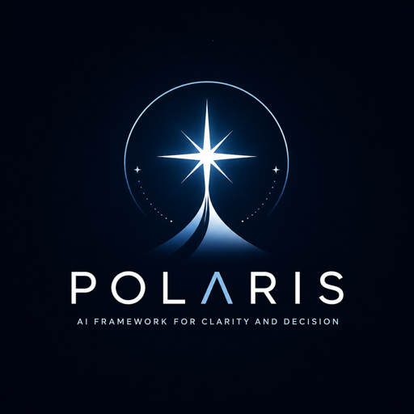

<p align="center">
  
</p>

# Polaris

English | [中文](./README.zh-TW.md)

A Claude Code / Codex workspace template that turns your AI assistant into a strategist — it learns your team's workflow, routes tasks to specialized skills, and evolves its own rules from daily usage.

## Who is this for?

- **Developers** — automate the JIRA → branch → code → PR loop, enforce team conventions through AI
- **Tech leads** — standardize estimation, code review, and sprint planning across the team
- **PMs and Scrum Masters** — generate standups, track worklogs, run sprint planning — no coding required
- **Multi-company freelancers** — manage multiple clients in one workspace with isolated rules, skills, and config

> Not sure? If your team uses JIRA + GitHub and you want Claude Code to follow your workflow instead of improvising, Polaris is for you.

## The Three Pillars

Polaris organizes your AI-assisted workflow around three pillars:

| Development Assistance 輔助開發 | Self-Learning 自我學習 | Daily Operations 日常紀錄 |
|:---:|:---:|:---:|
| JIRA → branch → code → PR | Feedback → pattern → rule | Standup, sprint, worklog |
| Automates the full ticket lifecycle | Evolves its own rules from daily use | Sprint lifecycle for the whole team |

### Pillar 1 — Development Assistance (輔助開發)

You tell Claude Code what you want. Polaris handles the rest:

```
You:     "做 PROJ-123"
Polaris: reads JIRA ticket → checks prerequisites → estimates story points
         → breaks into sub-tasks → creates JIRA sub-tickets
         → opens feature branch → implements code → runs tests
         → opens PR with coverage report → transitions JIRA to CODE REVIEW
```

**Skills:** `engineering`, `bug-triage`, `breakdown`, `converge`, `sasd-review`, `refinement`, `git-pr-workflow`, `review-pr`, `pr-pickup`, `check-pr-approvals`, `verify-AC`, `visual-regression`, `intake-triage`, `my-triage`, `unit-test`

Deep dive → [Developer Workflow Guide](docs/workflow-guide.md)

### Pillar 2 — Self-Learning (自我學習) ★

This is what makes Polaris different from a static template. It accumulates team knowledge and evolves its own rules from daily usage:

1. **Feedback capture** — when you correct Claude's approach, it saves the lesson
2. **Direct rule promotion** — confirmed corrections are immediately promoted to permanent rules, no waiting for repeated triggers
3. **External learning** — study articles, repos, or PRs and extract patterns applicable to your codebase
4. **Cross-session knowledge** — technical insights (patterns, pitfalls, architecture decisions) persist in `learnings.jsonl` across conversations with confidence-based decay, so each session starts with accumulated project knowledge instead of a blank slate
5. **Session timeline & checkpoints** — significant events (skill invocations, PRs, commits) are logged to `timeline.jsonl` for accurate standup reports; `/checkpoint` saves and restores session state for long-running work
6. **Memory tiering** — `memory/` entries follow a Hot/Warm/Cold lifecycle so `MEMORY.md` stays small and every new session starts with only relevant context; `/memory-hygiene` prunes manually, a session-start hook surfaces decay candidates automatically
7. **Challenger audit** — pre-release, sub-agents review the workspace from a new user's perspective

> **Example:** You correct Claude's import ordering in a PR review. The correction is saved, confirmed as a real pattern, and immediately promoted to a permanent rule — all future PRs follow the convention automatically.

**Skills:** `learning`, `checkpoint`, `memory-hygiene` — plus lesson extraction built into `review-pr`, `engineering` (revision mode), and `check-pr-approvals`

### Pillar 3 — Daily Operations (日常紀錄)

Sprint lifecycle automation for PMs, Scrum Masters, and developers — no coding required:

```
You:     "standup"
Polaris: collects JIRA activity + git commits + calendar meetings
         → groups by team → formats as YDY/TDT/BOS → posts to Confluence

You:     "sprint planning"
Polaris: pulls JIRA backlog → calculates team capacity → detects carry-overs
         → suggests priority order → drafts Release page
```

**Skills:** `standup`, `sprint-planning`, `my-triage`, `refinement` (PM perspective), `breakdown` (PM perspective)

## What is Claude Code?

[Claude Code](https://docs.anthropic.com/en/docs/claude-code) is Anthropic's coding agent — it runs in your terminal, IDE (VS Code / JetBrains), or as a desktop app. You chat with it, and it reads files, writes code, runs commands, and calls external services. Polaris is a workspace template that sits on top of Claude Code, giving it your team's skills and rules.

> If you've used Claude on claude.ai, Claude Code is the same AI but with access to your codebase and tools. Polaris teaches it your team's specific workflow.

## Prerequisites

**Everyone needs:**
- **A supported agent runtime** — [Claude Code](https://docs.anthropic.com/en/docs/claude-code) (CLI, desktop app, or IDE extension) or Codex configured with the [Codex quick start](docs/codex-quick-start.md)

> **Claude Code note:** Most Polaris skills use sub-agents, which require the **Max plan** ($100/mo) or API access. On Pro/Team plans, only single-step skills will work.
- **Atlassian MCP** — connects Claude Code to JIRA and Confluence
- **Slack MCP** — for notifications and reports (`standup`, `review-inbox`, `check-pr-approvals`)

**Developers also need:**
- **Git** and **GitHub CLI** (`gh`) — authenticated with your org

**Optional:**
- **Google Calendar MCP** — adds meeting context to `standup`
- **Figma MCP** — used when JIRA tickets reference Figma designs

> **MCP setup**: MCP servers connect Claude Code/Codex to external services.
>
> **Claude Code (recommended):**
> - Use `/mcp` to connect claude.ai connectors directly
> - Slack: `https://mcp.slack.com/mcp`
> - Atlassian: `https://mcp.atlassian.com/v1/mcp`
>
> **Codex (mirror the same connectors):**
> ```bash
> codex mcp add claude_ai_Slack --url https://mcp.slack.com/mcp
> codex mcp add claude_ai_Atlassian --url https://mcp.atlassian.com/v1/mcp
> codex mcp login claude_ai_Slack
> codex mcp login claude_ai_Atlassian
> codex mcp list
> ```
>
> Note: legacy stdio `npx @anthropic-ai/claude-code-mcp-*` setup is deprecated in this framework.
> See [MCP server docs](https://docs.anthropic.com/en/docs/claude-code/mcp-servers) for Google Calendar and Figma setup.

## Quick Start

Using Codex instead of Claude Code? See [Polaris for Codex](docs/codex-quick-start.md).

### 1. Create your workspace

Go to the [Polaris template repo](https://github.com/HsuanYuLee/polaris) on GitHub, click **"Use this template" → "Create a new repository"**, then clone it:

```bash
git clone https://github.com/YOUR-ORG/your-polaris-workspace ~/polaris-workspace
cd ~/polaris-workspace
```

> **Tip**: Choose a dedicated directory name. Avoid `~/work` — many developers already use that path for other projects.

> **PMs and non-developers:** See the [PM Setup Checklist](docs/pm-setup-checklist.md) — it tells you exactly what to ask your developer and what to do after setup. Then jump straight to Step 4.

### 2. Run `/init` to set up your company

> **Note:** `/commands` like `/init` are typed inside Claude Code conversations, not in your terminal shell.

Open Claude Code inside the workspace — in your terminal, run `claude` from the workspace directory (or open the folder in VS Code with the Claude Code extension). Then type:

```
/init
```

The interactive wizard will:
- Set preferred response language (or read from existing config)
- Detect your GitHub org and repos
- Create a company directory with `workspace-config.yaml`
- Set up project mappings (JIRA keys → local repo paths)

After `/init` completes, your workspace will look like this:

```
~/polaris-workspace/              ← your workspace root (this repo)
├── CLAUDE.md                     ← AI strategist instructions
├── workspace-config.yaml         ← routes JIRA keys to companies
├── .claude/
│   ├── rules/                    ← universal rules (L1)
│   │   └── your-company/         ← company-specific rules (L2)
│   └── skills/                   ← 25 workflow skills
└── your-company/                 ← created by /init
    ├── workspace-config.yaml     ← company config (JIRA, Slack, repos)
    └── your-project/             ← your existing repo (cloned or linked)
        └── .claude/CLAUDE.md     ← project-level rules (L3)
```

Verify setup by trying: `"做 PROJ-123"` (replace with a real ticket key). If Polaris reads the ticket successfully, you're good to go.

### 3. Start using skills

Once initialized, just talk to Claude Code naturally — English or 中文 both work:

```
"做 PROJ-123"         / "work on PROJ-123"   → full development workflow / 完整開發流程
"fix bug PROJ-456"    /「修 bug PROJ-456」    → root cause → fix → PR / 根因分析 → 修復 → 發 PR
"review PR"           /「review 這個 PR」     → code review with inline comments
"estimate PROJ-789"   /「估點 PROJ-789」      → story point estimation / Story point 估算
"standup"             /「standup」            → generate daily standup report / 產出站會報告
"sprint planning"     /「排 sprint」          → pull tickets, calculate capacity / 拉票、算容量
"learn from <url>"    /「學習這個」            → study external resource, extract patterns
```

### Start here

Don't try all 25 skills at once. Pick one that matches your role:

| If you are a... | Try this first | What happens |
|-----------------|----------------|--------------|
| **Developer** | `「做 PROJ-123」` / `"work on PROJ-123"` | Reads JIRA → estimates → creates branch → codes → opens PR |
| **PM / Scrum Master** | `"standup"` / `「standup」` | Collects yesterday's JIRA + git activity → formats report |
| **Tech Lead** | `"sprint planning"` / `「排 sprint」` | Pulls backlog → calculates capacity → suggests priority |

Everything else builds on these. Explore more skills as you get comfortable.

### PM & Scrum workflow

Polaris covers the full sprint lifecycle — no coding or git knowledge required. All PM skills require the **Max plan** ($100/mo) or API access due to sub-agent usage.

```
Sprint planning    →  "sprint planning" / 「排 sprint」
                      Pulls JIRA backlog → calculates team capacity → detects carry-overs
                      → suggests priority order → drafts Release page

Daily standup      →  "standup" / 「standup」
                      Collects JIRA status changes + git commits + calendar meetings
                      → groups by team → formats as YDY/TDT/BOS
                      (Yesterday Did / Today Do / Blockers or Shoutouts)

Refinement         →  "refinement EPIC-100" / 「refinement EPIC-100」
                      Reads Epic content → identifies gaps (Polaris reads the codebase for you)
                      → drafts AC, scope, edge cases → writes back to JIRA

Breakdown          →  "work on EPIC-100" / 「做 EPIC-100」
                      Epic → sub-tasks with story point estimates → batch-creates in JIRA

My triage          →  "my work" / 「盤點」
                      Scans assigned Epics + Bugs + orphan Tasks → validates JIRA status
                      → produces priority dashboard
```

> **PMs and Scrum Masters:** Everything below this point is for developers and framework maintainers. You're all set!
> If a skill isn't working, check that your Atlassian MCP and Slack MCP connections are active in Claude Code settings — that covers 90% of PM setup issues.
>
> 中文版包含完整 PM 工作流程說明：[docs/quick-start-zh.md](docs/quick-start-zh.md#pm-與-scrum-工作流程)

## How it works

### Three-layer architecture

| Layer | Location | When loaded | What it contains |
|-------|----------|-------------|------------------|
| **L1 — Workspace** | `CLAUDE.md` + `.claude/rules/` | Every conversation | Strategist persona, delegation rules |
| **L2 — Company** | `.claude/rules/{company}/` | Every conversation | Skill routing, PR conventions, JIRA workflow |
| **L3 — Project** | `{company}/{project}/CLAUDE.md` | When working in project | Lint config, test patterns, component conventions |

Rules are always loaded. Skills load on-demand — they don't consume context until triggered.

### Workflow orchestration

Skills chain together to automate the full ticket lifecycle. See **[Developer Workflow Guide](docs/workflow-guide.md)** for the complete flow with diagrams, including:
- Ticket lifecycle (Feature / Bug / Hotfix paths)
- AC and handoff gates (5 deterministic checkpoints)
- Skill call graph (how skills invoke each other)
- Code review and learning pipelines

> Your company may have a customized version at `{company}/docs/rd-workflow.md`.

### Scheduled agents

**Scheduled agents** — recurring tasks (daily learning scan, periodic checks) run as remote triggers on a cron schedule via `/schedule`. This lets Polaris perform background work (e.g., scanning tech articles, running health checks) without requiring a live conversation.

### Directory structure

```
your-workspace/
├── CLAUDE.md                  # Strategist persona + delegation rules
├── workspace-config.yaml      # Company routing (gitignored; copy from .example)
├── .claude/
│   ├── rules/                 # Universal rules (L1)
│   │   └── {company}/         # Company rules (L2)
│   └── skills/                # 25 workflow skills
├── _template/                 # Template for new companies + rule examples
├── scripts/                   # Sync utilities
└── {company}/                 # Your company directory
    ├── workspace-config.yaml  # Company config (projects, JIRA, etc.)
    ├── {project-a}/           # Project with its own CLAUDE.md (L3)
    └── {project-b}/
```

## Multi-company setup

Polaris supports multiple companies in a single workspace. Each company gets its own config, rules, and skills:

```
your-workspace/
├── workspace-config.yaml          # Routes JIRA keys to companies
├── .claude/rules/
│   ├── *.md                       # Universal rules (all companies)
│   ├── acme/                      # Acme-specific rules
│   └── bigcorp/                   # BigCorp-specific rules
├── .claude/skills/
│   ├── *.md (or dirs)             # Shared skills (version-controlled)
│   ├── acme/                      # Acme-only skills (gitignored)
│   └── bigcorp/                   # BigCorp-only skills (gitignored)
├── acme/                          # Acme projects + config
└── bigcorp/                       # BigCorp projects + config
```

**How isolation works:**

- **Config routing** — `workspace-config.yaml` maps JIRA project prefixes to companies. When you say "work on ACME-123", Polaris reads Acme's config
- **Rules scoping** — all rules load into every conversation (Claude Code limitation), but company rules include a scope header. The Strategist only applies rules matching the active company
- **Skills isolation** — shared skills are in `.claude/skills/` (tracked in git). Company-specific skills go under `.claude/skills/{company}/` (gitignored)
- **Diagnostics** — run `/use-company PROJ-123` to see which company a ticket routes to (diagnostic mode), `/use-company` to explicitly set context, or `/validate` to scan for scope header issues and memory tag violations

**Adding a second company:**

```
/init
```

The wizard detects existing companies and creates the new one alongside them. After setup, run `/validate` to verify no rules are missing scope headers.

> **Note:** If two companies share the same JIRA project prefix, use `/use-company` to explicitly set context — automatic routing cannot distinguish them.
>
> See `.claude/rules/multi-company-isolation.md` for the full scoping strategy.

## Customization

| What | Where | How |
|------|-------|-----|
| Add a new company | Run `/init` | Interactive wizard creates everything |
| Map JIRA projects to repos | `{company}/workspace-config.yaml` | Add entries to `projects:` |
| Add company-specific rules | `.claude/rules/{company}/` | Create `.md` files — auto-loaded every conversation |
| Add project-specific rules | `{company}/{project}/CLAUDE.md` | Loaded when sub-agent enters project |
| Create a new skill | Run `/skill-creator` | Guided skill creation with eval |
| Modify skill routing | `.claude/rules/{company}/skill-routing.md` | Maps trigger phrases → skills |

## What not to touch

These are framework internals. Edit them only if you're modifying the Polaris framework itself:

| Path | Why |
|------|-----|
| `.claude/skills/*/SKILL.md` | Skill definitions — use `/skill-creator` to modify |
| `.claude/skills/references/` | Shared data (estimation scales, templates) used by skills |
| `.claude/rules/*.md` (L1) | Universal rules — loaded every conversation |
| `_template/` | Templates for `/init` wizard |
| `scripts/` | Sync utilities between template and instances |
| `CLAUDE.md` | Strategist persona — the brain of the framework |

**Safe to edit:**

| Path | What to customize |
|------|-------------------|
| `.claude/rules/{company}/` | Your company's conventions, routing, JIRA workflow |
| `{company}/workspace-config.yaml` | JIRA projects, Slack channels, repo mappings |
| `{company}/{project}/CLAUDE.md` | Project-specific rules (L3) |

## Upgrading

If you cloned from the Polaris template and want to pull framework updates:

```bash
# From the Polaris template repo:
./scripts/sync-from-polaris.sh --polaris ~/path-to-polaris-template [--dry-run]
```

This syncs skills, rules, and references while preserving your company config, L2 rules, and project-specific files. Use `--dry-run` to preview changes before applying.

After apply mode, the upgrade flow also runs:
- `scripts/transpile-rules-to-codex.sh`
- `scripts/verify-cross-llm-parity.sh`

> See `scripts/sync-from-polaris.sh --help` for full options.

## About the name

> Polaris — the North Star. A fixed point that guided travelers to places they never imagined reaching. This framework does the same: it helps you navigate complexity and arrive further than you thought possible.

## Acknowledgements

Polaris draws inspiration from these open-source projects:

| Project | Author | What we learned |
|---------|--------|----------------|
| [superpowers](https://github.com/obra/superpowers) | Jesse Vincent | Agentic skills framework, spec-first development, sub-agent task division |
| [ab-dotfiles](https://github.com/AlvinBian/ab-dotfiles) | Alvin Bian | AI-driven dev environment management, `/init` smartSelect interaction, audit trail |
| [get-shit-done](https://github.com/gsd-build/get-shit-done) | TÂCHES | Context engineering patterns, goal-backward verification, sub-agent completion envelope, complexity tier routing |
| [skill-sanitizer](https://github.com/cyberxuan-XBX/skill-sanitizer) | cyberxuan-XBX | 7-layer pre-LLM security scanning, code block context awareness, severity scoring with false-positive reduction |

## Security

Polaris operates with a strict **zero-telemetry, zero-cloud** policy:

- **No data leaves your machine** — all memory, learnings, timelines, and session state are stored locally under your workspace and `~/.polaris/`
- **No analytics or tracking** — no `telemetry-sync`, no `eureka.jsonl`, no usage reporting of any kind
- **No external network calls** — Polaris never phones home; the only network activity comes from tools you explicitly invoke (git, gh, JIRA, Slack)
- **PreToolUse safety hooks** — `scripts/safety-gate.sh` blocks dangerous operations (destructive deletes, force-push to main, writes outside allowed directories) at the shell level, before they execute
- **Workspace language policy gate** — downstream-facing PR, JIRA, Slack, Confluence, commit, and release prose is checked against the configured workspace language; bilingual documentation uses explicit source/translation modes so English source docs stay valid
- **All code is auditable** — skills, rules, and scripts are plaintext files in your repo. No obfuscated binaries, no symlink farms, no hidden install scripts

When evaluating external Claude Code skills or frameworks, we recommend scanning them with tools like [skill-sanitizer](https://github.com/cyberxuan-XBX/skill-sanitizer) before integration.

## License

[MIT](LICENSE)
