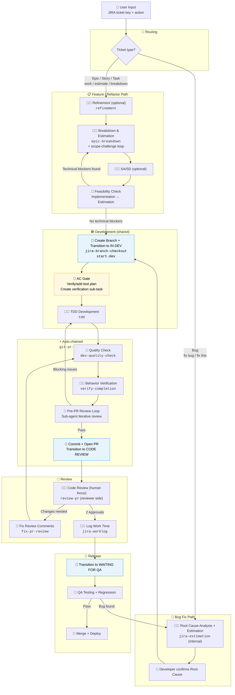
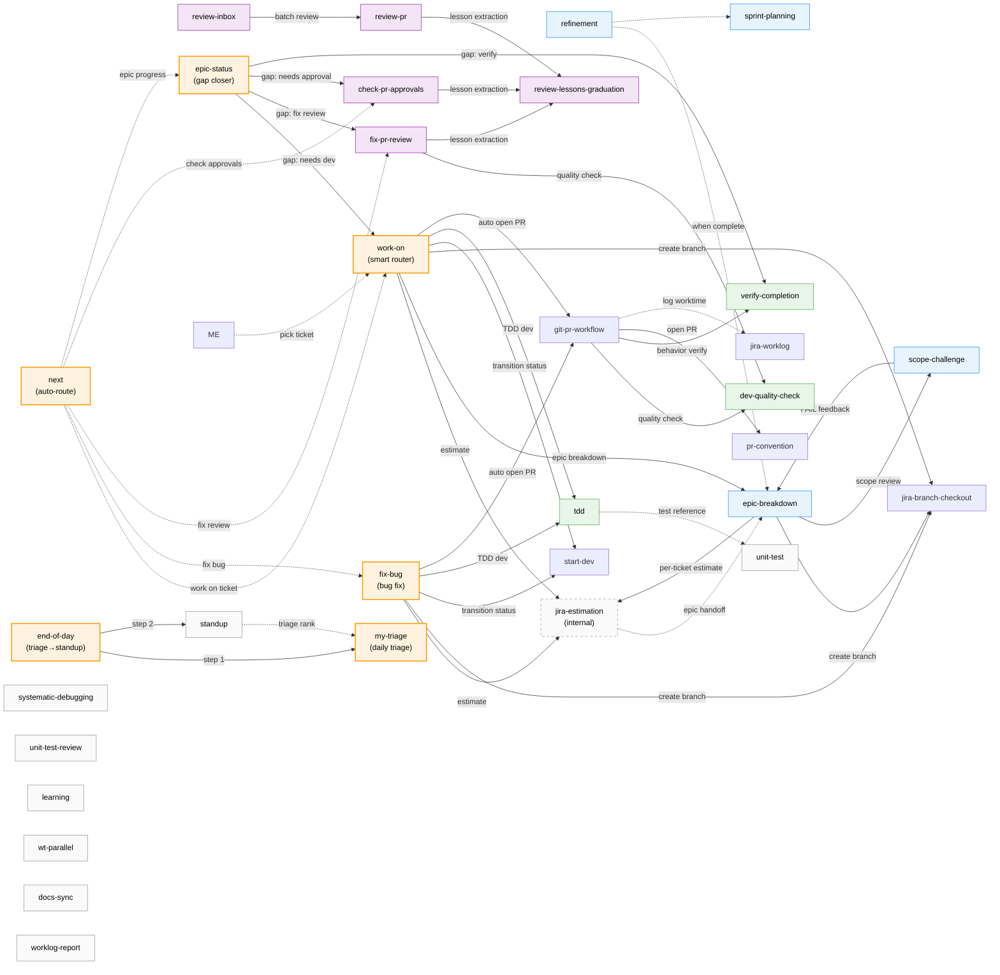

# Developer Workflow Guide

English | [中文](./workflow-guide.zh-TW.md)

> This is the generic Polaris workflow. Your company may have a customized version at `{company}/docs/rd-workflow.md`.

> **Pillar 1 — Development Assistance (輔助開發)**: This guide is the deep-dive reference for Polaris's first pillar. For an overview of all three pillars, see the [README](../README.md#the-three-pillars).

This guide covers the end-to-end developer workflow orchestrated by Polaris skills, from ticket intake to production merge. It marks which steps AI handles automatically, which require human confirmation, and which are human-only.

**Goal: let developers focus on thinking and decisions — delegate repetitive operations to AI.**

> Legend: 🤖 = AI executes automatically | 🤖👤 = AI-assisted, human confirms | 👤 = human only

For Git Flow and PR conventions, refer to your company's Git workflow documentation.
For full skill reference, see `.claude/skills/` and the company skills directory.

---

## Ticket Lifecycle

`work-on` and `fix-bug` are the two primary orchestrators. Feature, Bug, and Refactor paths share the Quality → PR → Release tail.



> **Blue nodes** = automatic JIRA status transitions (IN DEV / CODE REVIEW). **Yellow nodes** = AC Gate (auto-add test plan + create verification sub-task). The quality-check-to-PR chain is fully automated — no manual trigger required.

---

## AC Closure Gates

Acceptance Criteria pass through 4 automated gates from ticket intake to PR open, ensuring nothing is missed:

| Gate | When | Mechanism | On Failure |
|------|------|-----------|------------|
| **1. Readiness Gate** | `work-on` start | Checks whether the ticket has verifiable AC; blocks if quality is insufficient | Blocks development, prompts to add AC |
| **2. AC ↔ Sub-task Traceability** | After `epic-breakdown` | Produces a traceability matrix confirming every AC is covered by a sub-task | Blocks sub-task creation, flags missing AC |
| **3. Per-AC Verification** | `verify-completion` behavior check | Confirms each AC is satisfied (✅ / ❌) | Blocks PR open; ❌ items must be fixed |
| **4. AC Coverage Checklist** | `git-pr-workflow` PR open | Embeds AC checklist in PR description automatically | Reviewer sees coverage status at a glance |

> These 4 gates ensure AC never falls through the cracks. Even if a PM writes vague AC, Gate 1 catches it at the earliest possible stage.

---

## Skill Orchestration

How skills invoke and delegate to each other. Solid arrows = invoke (skill calls skill internally); dashed arrows = optional delegation.



**Connectivity check:**
- Every skill has at least one inbound edge (invoked by another skill) or is a direct user entry point
- `next` is a meta-router — auto-determines and invokes the correct next skill based on context (todo, git branch, JIRA status, PR status)
- `my-triage` triages all assigned work (Epics, Bugs, orphan Tasks); feeds priority ranking into `standup` TDT section
- `end-of-day` chains `my-triage` → `standup` as a single end-of-day routine
- `epic-status` tracks Epic progress and auto-routes gaps to the appropriate skill
- `standup`, `systematic-debugging`, `learning`, `wt-parallel`, `unit-test-review`, `docs-sync`, `worklog-report` are standalone skills — triggered directly by the user, not part of the main chain

---

## Feature Development

### Step 1. 👤 Confirm Spec — Obtain a PRD or Epic ticket

Sync with PM, Design, and QA to confirm the PRD and scope before proceeding.

### Step 1a. 🤖👤 Refinement (optional)

`refinement` skill covers the full spectrum from "discovered a problem" to "requirement is complete":

**Entry 1 — Developer-initiated discovery (Phase 0):**

```
I want to refactor <component>
```

AI analyzes the codebase and produces: problem analysis, impact assessment (non-technical language for PM/QA), and a JIRA ticket draft. Confirms before creating the ticket.

**Entry 2 — Incomplete Epic from PM (Phase 1):**

```
refinement PROJ-3000
```

AI reads the Epic and codebase, runs 8 completeness checks (background, AC, scope, edge cases, design, API, dependencies, out of scope), and **produces a suggestion draft** written back as a JIRA comment. PM replies, and you can re-run until the completeness threshold is met.

**Entry 3 — Requirement is clear, discuss approach (Phase 2):**

```
What's the best approach for this ticket?
```

AI produces 2–3 implementation options + a comparison matrix + Decision Record, written back as a JIRA comment.

**When to skip Refinement:** implementation is clear and small-scope (≤ 3 points), pure bug fixes, config-only changes.

> Trigger keywords: `refinement`, `brainstorm`, `discuss requirement`, `enrich this epic`, `what's missing`, `tech debt`, `how should we implement this`

### Step 1b. 🤖👤 Scope Challenge (optional, advisory)

Before breakdown and estimation, AI can challenge the scope assumptions:

```
scope challenge PROJ-3000
```

AI executes `scope-challenge`: reads the ticket, proposes 2–3 alternative approaches with trade-off comparisons, and recommends one of: proceed as-is / simplify / split / request more info.

**This is an advisory gate — it does not block the flow.** Even if the recommendation is to simplify, the developer can decide to proceed with the original scope.

> Trigger keywords: `scope challenge`, `challenge requirement`, `scope review`

### Step 2. 🤖👤 Estimate Epic — Break Down into Sub-tasks

AI launches an **Estimation Agent** to decompose the Epic into executable sub-tasks, each with story point estimates.

```
estimate PROJ-3000
```

AI executes automatically:

1. Reads Epic content (Summary, Description, AC, PRD/design links)
2. Detects existing sub-tasks or feature branch progress to avoid duplication
3. **Runs parallel Explore sub-agents** to scan the codebase (UI layer, logic layer, API+types+tests), getting summaries before breaking down — avoids flooding the context window with raw source code
4. Determines breakdown strategy based on Epic size:
   - **Small Epic (≤ 5 pts)** — single sub-task, no over-splitting
   - **Medium Epic (6–13 pts)** — 2–4 sub-tasks
   - **Large Epic (13+ pts)** — 4+ sub-tasks, each 2–5 pts
5. Breaks down by feature module (not by technical layer); estimates each sub-task
6. **Attaches a Happy Flow verification scenario** to each sub-task (laying groundwork for e2e tests)
7. Presents the breakdown table for review and discussion **before creating JIRA sub-tasks**
8. After confirmation, **creates JIRA sub-tasks in parallel via sub-agent** (batch create, fill estimates, update parent total)

**Breakdown table format:**

| # | Sub-task Name | Points | Notes | Happy Flow Verification |
|---|---------------|--------|-------|------------------------|
| 1 | ... | 3 | ... | 1. User navigates to X → 2. Clicks Y → 3. Expects to see Z |

**Breakdown principles:**
- **Do not force-split a feature that cannot be tested independently** — keep it as one sub-task to avoid untestable fragments
- **Implementation details go in sub-task description, not the parent ticket** — the parent retains only the requirements overview and breakdown summary
- **Happy Flow scenarios** are written from the user's perspective, aligned with given-when-then thinking

> Trigger keywords: `estimate`, `estimate epic`, `breakdown`, `sub-tasks`, `epic breakdown`, `create sub-tasks`

### Step 3. 🤖👤 Write SA/SD (optional)

After sub-tasks are created, AI asks whether to produce SA/SD documentation. Recommended for high-complexity work (typically 8+ points or cross-module changes).

```
PROJ-1234 SASD
```

AI analyzes the JIRA ticket and codebase, producing: change scope, system flow diagram, frontend design, task list (with estimates), and timeline. Output is saved to your company's documentation location (configure `{confluence_url}` or equivalent in workspace config).

> If Step 2 epic breakdown was already run, SA/SD **reuses the breakdown's task list and estimates** — no re-estimation.

> Trigger keywords: `SASD`, `SA/SD`, `system analysis`, `change scope`, `dev scope`

### Step 4. 🤖👤 Feasibility Verification (Implementation Agent ↔ Estimation Agent Loop)

After SA/SD (or if skipped), AI launches an **Implementation Agent** to verify feasibility before coding begins.

**Implementation Agent:**
1. Reads sub-task content and SA/SD from JIRA/docs
2. **Runs parallel Explore sub-agents** (UI layer, logic layer, API+types+tests — one sub-agent each, returns summary) to avoid flooding the context window
3. Plans the implementation approach based on the summaries and checks for **technical blockers**

**Technical blocker definition:**

| Counts as a blocker ⚠️ | Does NOT count ✅ |
|------------------------|------------------|
| Estimated approach is unworkable (API doesn't exist, component doesn't support required props) | Just needs more lines of code |
| Impact is much larger than described (changing A also breaks B and C) | Needs to look up API parameter docs |
| Requires cross-project changes (must update Design System before using in app) | Complex but direction is clear |

**Flow:**

```
Implementation Agent
  │
  ├─ No blockers → Proceed to Step 5 (start development)
  │
  └─ Blockers found → Returns specific problems
        │
        ▼
     Estimation Agent re-estimates
        ├─ Updates JIRA sub-task (points, description)
        ├─ Updates SA/SD (same page, not a new one)
        ├─ Estimate change > 30%? → Yes → 👤 Pause for developer confirmation
        │                          → No  → Auto-continue
        ▼
     Implementation Agent re-verifies
        │
        ... up to 2 re-estimation rounds ...
        │
        > 2 rounds → 👤 Escalate to developer for manual handling
```

**Agent-to-agent context passing:** JIRA and documentation serve as shared memory between agents. Estimation Agent writes → Implementation Agent reads, ensuring no context loss.

> This step is triggered automatically inside `estimate ticket` — no separate command needed.

### Step 5. 🤖 Auto-enter Development (dependency-graph driven)

After Step 4 feasibility check passes, development begins automatically without manual confirmation.

**Branch strategy:**

Branch from the main development branch for the parent Epic, with each sub-task getting its own branch that PRs back into the parent:

```
develop (or main)
  └─ feat/{EPIC-KEY}-some-feature  (parent branch)
       ├─ feat/{PROJ-3001}-sub-feature-a → PR → merge into parent
       ├─ feat/{PROJ-3002}-sub-feature-b → PR → merge into parent
       └─ fix/{PROJ-3003}-fix-something  → PR → merge into parent
```

Branch naming: `{task-type}/{JIRA-KEY}-{semantic-description}`, where task type reflects the primary change (feat, fix, refactor, etc.).

After all sub-task PRs are reviewed and merged, the parent branch → develop PR is opened manually by the developer (no additional code review required — sub-tasks were each reviewed individually).

**Dependency analysis and scheduling:**

The Implementation Agent in Step 4 produces a **dependency graph** for sub-tasks. Development is scheduled accordingly:

```
Example:
Sub-task A (new composable) ──→ Sub-task C (page uses A's composable)
Sub-task B (standalone API route)   Sub-task D (standalone style change)

Schedule: A + B + D develop in parallel → start C after A is merged
```

**Execution:**
1. Create parent branch from develop (`{task-type}/{EPIC-KEY}-{description}`)
2. Create each sub-task branch from the parent (`{task-type}/{JIRA-KEY}-{description}`)
3. Sub-tasks with no dependencies → **parallel agents develop simultaneously**
4. Sub-tasks with dependencies → start after upstream sub-task is merged into parent branch
5. Each sub-task status auto-transitions to `In Development`
6. Each sub-task opens its PR independently after completion — no waiting for all to finish

> To manually specify a single sub-task: `start dev PROJ-459`

#### 🤖 Batch Mode (parallel multi-ticket development)

When multiple tickets are provided, `work-on` enters batch mode automatically:

```
work on PROJ-100 PROJ-101 PROJ-102
```

**Two-phase flow:**
1. **Phase 1 (parallel analysis):** Multiple sub-agents simultaneously analyze each ticket (read JIRA, assess status, evaluate estimates)
2. **👤 Confirm:** Presents a routing summary for developer to confirm
3. **Phase 2 (parallel implementation):** Multiple sub-agents develop in **worktree isolation** to prevent git conflicts

> Each ticket in batch mode also runs the full quality check → Pre-PR Review → open PR chain.

### Step 6. 🤖👤 Development

Each Implementation Agent implements code on its own branch (reusing the Explore summaries from Step 4).

**Development principles:**
- **Plan-first:** If estimated impact exceeds 3 files or requires an architectural decision, the agent enters Plan mode to produce an implementation plan before writing any code — avoids going in the wrong direction
- **Worktree isolation for batch:** When multiple sub-tasks develop in parallel, each agent uses an isolated git worktree to prevent file overwrites or git conflicts

After development is complete, each sub-task reports its changes to the developer for confirmation independently (without waiting for other sub-tasks). After confirmation, that sub-task automatically proceeds to Step 7 quality check.

**Rule adherence:** AI follows `.claude/rules/` rule files automatically during implementation, ensuring code meets project conventions (naming, formatting, components, store, API, TypeScript, CSS, design tokens, etc.).

#### Step 6a. 🤖 TDD Development Mode (optional)

For logic-intensive changes (utility functions, composables, store, API transformers), use TDD mode to ensure every step has test coverage.

```
TDD
```

or:

```
write tests first
```

AI executes `tdd` skill, enforcing **Red-Green-Refactor** cycles:

1. **🔴 RED** — Write a failing test; run it to confirm failure
2. **🟢 GREEN** — Write minimal code to make the test pass
3. **🔄 REFACTOR** — Improve code quality; confirm tests still pass
4. Repeat until all behaviors are implemented

**Structured cycle output:**

```
── Cycle 1 ──────────────────────────────
🔴 RED:      it('returns empty array when no results match')
🟢 GREEN:    Created filterResults() with early return
🔄 REFACTOR: (none needed)
✅ ALL TESTS: 1 passed, 0 failed
```

**When to use TDD / when to skip:**

| Use TDD | Skip TDD |
|---------|----------|
| Utility functions | Pure template/style changes |
| Composables (with logic) | Config files |
| Store actions/mutations | Type definitions |
| Complex conditional logic | Simple prop-forwarding components |

> Trigger keywords: `TDD`, `test driven`, `write tests first`, `red green refactor`

### Step 7. 🤖 Quality Check (including Patch Coverage)

Before opening a PR, run a quality check to ensure changes have sufficient test coverage.

```
quality check
```

AI executes `dev-quality-check` skill:

1. Identifies changed source files (excludes types, constants, index files, etc.)
2. Checks whether each source file has a corresponding test file
3. Runs related tests; confirms all pass
4. **Runs local coverage** to estimate patch coverage against the configured threshold
5. Outputs a quality report (✅ pass / ⚠️ needs more tests)

**Patch coverage note:** Coverage is measured only on the **lines added or modified in the current PR diff**, not the entire file. Configure the threshold in your `workspace-config.yaml` or equivalent (e.g., `{coverage_threshold}`).

**Common coverage issues:**

| Issue | Cause | Fix |
|-------|-------|-----|
| Entire file at 0% coverage | Tests only verify mock return values, never import and execute the source function | Rewrite tests to mock external dependencies but run real internal logic |
| Cannot test composable | Depends on framework runtime (e.g., Nuxt-specific imports) | Mock the framework import layer so builder functions run real logic |
| Type files affecting coverage | `.d.ts` / pure type files counted in report | Not an issue — v8 coverage ignores files with no runtime code |

**If the report shows ⚠️ or estimated patch coverage is below threshold, add tests before proceeding to PR.**

> Trigger keywords: `quality check`, `test coverage`, `coverage check`, `dev-quality-check`

### Step 7a. 🤖👤 Behavior Verification (Verify Completion)

After quality check (lint + test + coverage) passes, confirm the change works correctly at **runtime**. This step catches "tests pass but it doesn't actually work" issues — SSR hydration mismatches, missing runtime dependencies, layout shifts, etc.

```
verify
```

or:

```
confirm it's fixed
```

AI executes `verify-completion` skill:

1. Chooses verification method based on change type:
   - **UI components** → run dev server, check page rendering
   - **SSR/SEO** → `curl localhost:{port}/{path}`, inspect HTML output
   - **Bug fixes** → reproduce original bug steps, confirm they no longer trigger the issue
   - **Build/Config** → run build command, confirm it succeeds
2. Checks each JIRA AC one by one
3. Outputs a verification report:

```
── Verification Result ──────────────────
✅ AC match: 3/3 criteria satisfied
✅ Bug reproduction: original steps no longer trigger the error
✅ Build: build succeeded
── Conclusion: PASS (ready for PR) ─────
```

**When to skip:** pure config changes, type-definition-only changes, scenarios fully covered by CI.

> Trigger keywords: `verify`, `confirm it's fixed`, `check it works`, `acceptance check`

### Step 8. 🤖 Pre-PR AI Review Loop (Sub-agent Iterative Review)

After quality check passes and before committing, AI launches an independent Reviewer Sub-Agent to code review the diff. If blocking issues are found, the Dev Agent auto-fixes and re-submits — iterating until the review passes.

**This ensures PR quality is already verified before humans review it, greatly reducing back-and-forth.**

**Flow:**

```
Dev Agent                          Reviewer Sub-Agent (isolated context)
  │                                        │
  ├─ 1. Generate local diff ─────────────>│
  │                                        ├─ Read diff + .claude/rules/
  │                                        ├─ Check each item (type safety,
  │                                        │   boundary handling, test coverage,
  │                                        │   code style, structured data)
  │<──────────────── Return JSON result ───┤
  │                                        │
  ├─ 2. Any blocking issues?              │
  │    ├─ Yes → Auto-fix → back to 1     │
  │    └─ No  → Proceed to Step 9        │
  │                                        │
  └─ Max 3 rounds; ask developer if > 3  │
```

**Why a sub-agent:**
- **Context isolation:** Reviewer carries no development bias — fresh perspective on the diff
- **Context window efficiency:** Large diffs don't pollute the main conversation
- **Auto-fix:** Dev Agent fixes blocking issues automatically without human intervention

**Review checklist:**

| Item | Description |
|------|-------------|
| Type safety | interfaces/types updated in sync; no missing type assertions |
| Boundary handling | null checks, fallbacks, error handling are complete |
| Test coverage | changed source files have corresponding tests; assertions updated |
| Changeset | exists and is correctly formatted (if applicable) |
| Code style | conforms to `.claude/rules/` conventions (naming, formatting, import order) |

**Review result classification:**
- **Blocking:** must fix before PR (type errors, logic bugs, security issues, missing tests, formatting violations)
- **Non-blocking:** suggested improvements that don't block (naming style suggestions, micro-optimizations)

**Iteration limit: max 3 rounds.** If blocking issues remain after 3 rounds, lists remaining issues and asks the developer whether to fix manually or force-proceed.

> This step is part of the `git-pr-workflow` skill and runs automatically when you say "open PR".

### Step 9. 🤖 Development Complete — Open PR

```
open PR
```

AI executes the complete PR workflow (`git-pr-workflow`), fully auto-chained:

```
Branch → Simplify Loop → Quality Check → Pre-PR Review Loop → Commit → Changeset → Open PR → JIRA transition → Update PR desc → Post-PR Review Comment
```

**Step-by-step:**

| # | Step | Description |
|---|------|-------------|
| 1 | Create Branch | `jira-branch-checkout` creates the branch |
| 2 | **Simplify Loop** | Runs `simplify` to iteratively review code for reuse, quality, and efficiency (max 3 rounds) |
| 3 | Quality Check | `dev-quality-check`: tests + coverage + lint |
| 4 | Pre-PR Review Loop | Sub-agent iterative review (see Step 8), max 3 rounds |
| 5 | Commit | AI generates a conventional commit message |
| 6 | Changeset | Auto-adds changeset if applicable |
| 7 | Open PR | `gh pr create`; PR description auto-filled |
| 8 | JIRA transition | Auto-transitions status to `CODE REVIEW` |
| 9 | Update PR desc | **Embeds AC Coverage checklist** (reads JIRA AC items, marks coverage status) |
| 10 | Post-PR Review | Background sub-agent leaves a review comment |

> Trigger keywords: `open PR`, `create PR`, `PR workflow`, `commit and PR`, `changeset`, `full pr flow`, `pull request`, `ready for PR`

### Step 10. 🤖👤 Code Review (human focus)

Because Step 8's Pre-PR Review Loop completed AI triage and auto-fixed all blocking issues, human reviewers can focus on:

- **Business logic correctness** (domain requirements AI cannot judge)
- **Architectural soundness** (long-term maintainability, extensibility)
- **Performance and security** (potential N+1 queries, XSS risks, etc.)
- **UX considerations** (loading states, error state user experience)

Request review from teammates. After obtaining **2 or more approvals**, mark the PR as ready to merge. **Do not self-merge.**

> The PR will have a sub-agent review comment (tagged `🤖 Reviewed by Claude Code (sub-agent)`). Human reviewers may reference it but don't need to re-verify every item.

### Step 10a. 🤖 Fix PR Review Comments

After receiving review comments from human reviewers or automated tools, AI can automatically fix issues and reply to each comment.

```
fix review #1920
```

or paste the PR URL directly.

AI executes `fix-pr-review` skill:

1. Fetches all review comments on the PR (filters already-replied ones)
2. Reads `.claude/rules/` convention files
3. Analyzes each comment:
   - **Needs fixing** → edits code + replies "Fixed ✅"
   - **No fix needed** → replies with specific reasoning (cites rule reference)
   - **Needs discussion** → replies with a question, asks reviewer to confirm
4. **Re-runs quality check (Step 7) + Pre-PR Review Loop (Step 8)** to ensure fixes didn't introduce new issues
5. Commits and pushes once all comments are addressed
6. Outputs a fix summary report

**Every comment must receive a reply, whether or not a code change was made.**

> Trigger keywords: `fix review`, `address review comments`, `reply to review`

### Step 11. 🤖👤 Log Work Time

```
log worktime
```

AI estimates time based on the scope of changes, confirms with you, then records to JIRA automatically.

> Trigger keywords: `worklog`, `log time`, `log worktime`

### Step 12. 👤 Request QA Testing

Developer transitions the JIRA ticket status to `WAITING FOR QA`.

If QA reports a bug:
- Check out a fix from the feature branch, open a new PR targeting the feature branch
- Obtain approval and merge back into the feature branch
- Update the bug ticket status to waiting for QA

After acceptance, QA marks the ticket as ready for release.

### Step 13. 👤 Merge to Main Branch

Executed by the release manager. If there are conflicts, the developer resolves them by merging the target branch into their feature branch.

---

## Bug Fix

### Step 1. 👤 Confirm the Issue

Receive the bug ticket, confirm the problem description and reproduction steps.

### Step 2. 🤖👤 One-command Fix (fix-bug end-to-end)

```
fix PROJ-432
```

AI executes `fix-bug` skill, chaining all steps:

1. **Read JIRA ticket** → identify project (auto-matches project mapping)
2. **Root cause analysis** → scans codebase to find the **Root Cause** (specific code location or logic error)
3. **Propose fix** → produces **Solution** (files/modules to change) + estimate
4. **👤 Developer confirms** → Root Cause + Solution + estimate shown as JIRA comment; developer confirms before proceeding
5. **Create branch** + transition JIRA to `IN DEVELOPMENT`
6. **Implement fix** — AI follows `.claude/rules/` to ensure code meets project conventions
7. **Quality check** → tests + coverage (see Feature Development Step 7)
8. **Behavior verification** → confirm bug no longer reproduces (see Feature Development Step 7a)
9. **Pre-PR Review Loop** → sub-agent iterative review (see Feature Development Step 8)
10. **Open PR** → auto-transitions JIRA to `CODE REVIEW`

**If the actual root cause differs from the initial analysis:** AI adds a new JIRA comment flagging the revision (preserving the original comment for audit trail). Updated content includes: revised Root Cause / Solution, adjusted estimate (if changed), and a diff vs. the original.

Estimate changes > 30% trigger a pause for developer confirmation.

**JIRA comment format:**

| Field | Description |
|-------|-------------|
| **Root Cause** | Root cause of the issue; points to specific code location |
| **Solution** | Fix approach; lists files/modules to change |
| **Estimate** | X points (aligned to team estimation standards) |

> Note: "fix" + JIRA key → `fix-bug`; "fix" + PR URL → `fix-pr-review`

> Trigger keywords: `fix bug`, `fix this`, `start fix`, `fix this ticket`, `fix-bug`

### Step 3. 🤖👤 Code Review (human focus)

Pre-PR Review Loop already handled AI triage; human reviewers focus on business logic and architecture (see Feature Development Step 10).

After receiving review comments, use the fix review command to auto-fix and reply (see Feature Development Step 10a).

### Step 4. 🤖👤 Log Work Time

```
log worktime
```

### Step 5. 👤 Request QA Testing

Developer transitions JIRA status to `WAITING FOR QA`.

(Same flow as Feature Development Step 12.)

### Step 6. 👤 Merge

Executed by the release manager.

---

## Hotfix (Emergency Fix)

### Step 1. 👤 Receive urgent issue notification

The ticket details can be filled in after the fact, **but a ticket must exist**.

### Steps 2–12. Same as Bug Fix flow

Notes:
- Steps can be accelerated (e.g., approval count may be relaxed based on urgency)
- If already in regression testing, branch the fix from the `rc` branch (or equivalent)

---

## Code Review (as Reviewer)

When a teammate asks you to review their PR:

1. Check whether the PR already has an AI review comment (tagged `🤖 Reviewed by Claude Code (sub-agent)`) to understand what AI already checked
2. View the PR diff and description on GitHub
3. If an AI review comment is present, **focus on two areas**:
   - **Items not covered by AI:** business logic correctness, architectural soundness, performance and security (N+1, XSS), UX (loading/error states), commit granularity
   - **Items AI flagged:** do a deeper check to confirm AI's assessment is correct and nothing was missed
4. Tooling options:
   - `gh pr checkout <number>` to pull the code locally and run it
   - Online code browser (e.g., github.dev) for lightweight browsing
   - **AI-assisted review:** input `review PR #<number>` in Claude Code — AI reads the diff, checks against project conventions, produces a structured review result (blocking / suggestion / good), then automatically posts it as a COMMENT on the PR
   - **Approval status attached:** after AI review, the current approve count, who has approved, who needs to re-approve, and how many more are needed are shown — helps the reviewer decide next steps
5. Leave comments or suggestions directly on the PR
6. Approve when satisfied

### 🤖 Batch Review (Review Inbox)

When multiple PRs are waiting for your review:

```
review all PRs
```

AI automatically:
1. Scans all open PRs in the GitHub org needing review
2. Excludes your own PRs; filters for those that need your review or re-approval (including stale approve detection)
3. Sorts by PR creation date (oldest first); presents a list for your confirmation
4. After confirmation, launches parallel sub-agents for batch review (recommended: no more than 5 at a time)
5. Compiles results and sends a Slack notification with each PR's approval status

> Trigger keywords: `review all PRs`, `review inbox`, `batch review`, `scan PRs needing review`

### 🤖 Track Approval Status on Your Own PRs

After opening a PR and wanting to track review progress:

```
check PR status
```

AI automatically:
1. Scans all your open PRs in the GitHub org
2. **Rebases each PR to the latest base branch** (ensures reviewers see the latest code; no need to re-approve after rebase)
3. Queries approve counts per PR, including reviewer details (who has approved ✅, who needs to re-approve ⚠️)
4. Presents a list for you to choose which PRs to follow up on
5. Adds `need review` label and sends a Slack message to teammates for selected PRs

> Trigger keywords: `check PR status`, `PR approvals`, `my PRs`, `nudge reviewers`

---

## Continuous Learning

`learning` skill has three modes covering external research, PR lesson extraction, and daily article digestion:

| Mode | Purpose | Trigger example |
|------|---------|----------------|
| **External** | Research an external article or repo; analyze applicability to your workspace | `look at github.com/...`, `research this article` |
| **PR** | Extract review patterns from merged PRs → write to review-lessons | `learn from PR #123`, `learn from PRs this week` |
| **Queue** | Process articles collected by the daily learning scan (see below) | `daily learning`, `what can I learn today` |

### Queue Mode Architecture

A scheduled agent automatically scans for technical articles each day, filters for high-quality content relevant to your tech stack, and queues them for developers to process at their own pace.

```
Scheduled Agent (daily, configurable time)     Developer (manual trigger)
  │                                                    │
  ├─ WebSearch scans configured topic areas           │
  ├─ Filters 3–5 high-quality articles               │
  ├─ Deduplicates against queue + archive            │
  ├─ Writes to learning-queue.md                     │
  └─ Commits and pushes                              │
                                                      │
                          ┌───────────────────────────┘
                          ▼
                    "daily learning" / "what can I learn today"
                          │
                          ├─ Lists pending articles from queue
                          ├─ Developer selects which to read
                          ├─ Parallel sub-agents research each article
                          ├─ Batch presents recommendations (Worth doing now / Nice to have / Skip)
                          ├─ Developer confirms; AI executes changes
                          └─ Archives to learning-archive.md
```

### Scan Topics (configure in workspace-config or skills reference)

| Category | Topics |
|----------|--------|
| **AI Workspace** | Claude Code features, MCP integrations, multi-agent collaboration, skill design patterns |
| **Testing** | Mock patterns, test utilities, coverage optimization |
| **Performance** | Core Web Vitals best practices, SSR optimization |
| **Framework** | Framework-specific composable patterns, TypeScript type safety |
| **DX Toolchain** | Monorepo tooling, linting, CI/CD optimization |
| **Architecture** | Large-project organization, Design System versioning, monorepo strategy |

### Usage

**Morning workflow:**

```
daily learning
```

or:

```
what can I learn today
```

AI displays the queued articles; you pick which to process; AI batch-analyzes and presents recommendations. After your confirmation, AI executes changes (updates rules, adds references, adjusts skills) and archives processed items.

**Relevant files** (paths configured per company):
- `skills/references/learning-queue.md` — pending articles
- `skills/references/learning-archive.md` — processed records (with what was learned)
- Scheduled agent management: your Claude Code scheduled agents dashboard

> Trigger keywords (Queue mode): `daily learning`, `what can I learn today`, `any new articles`, `read articles`
> Trigger keywords (External mode): `look at this`, `research this`, `learn`, `study this`, `borrow ideas from`
> Trigger keywords (PR mode): `learn from PR`, `learn from recent PRs`, `study PR review`
