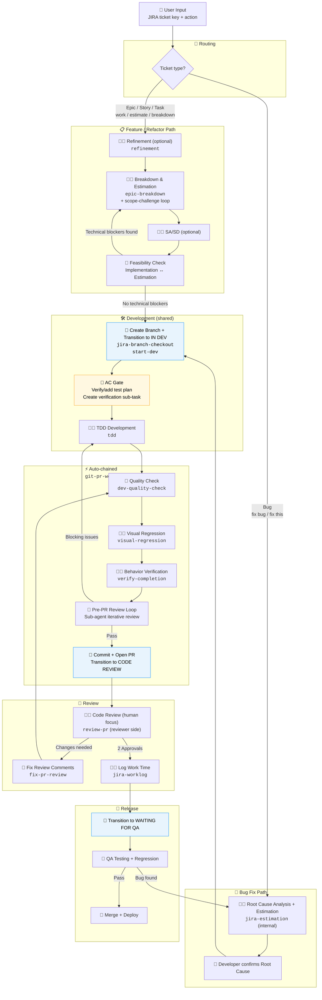
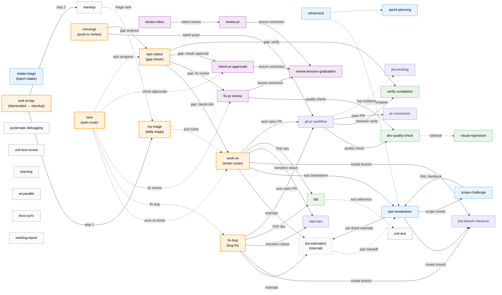

[English](./workflow-guide.md) | 中文

# 開發者工作流程指南

> 這是 Polaris 的通用工作流程。你的公司可能有客製化版本在 `{company}/docs/rd-workflow.md`。

> **支柱一 — 輔助開發**：本指南是 Polaris 第一支柱的深入參考。三大支柱的總覽請見 [README](../README.md#the-three-pillars)。

本指南涵蓋由 Polaris 技能協調的端到端開發者工作流程，從接單到合併上線。標示哪些步驟由 AI 自動處理、哪些需要人工確認、哪些完全由人工執行。

**目標：讓開發者專注於思考與決策 — 將重複性操作委派給 AI。**

> 圖例：🤖 = AI 自動執行 | 🤖👤 = AI 輔助，人工確認 | 👤 = 純人工

Git Flow 與 PR 慣例請參考公司的 Git 工作流程文件。
完整技能參考請見 `.claude/skills/` 與公司技能目錄。

---

## 單張票的生命週期

`work-on` 和 `fix-bug` 是兩個主要的流程協調器。Feature、Bug 和 Refactor 路徑共用品質檢查 → PR → 發布的尾端流程。



> **藍色節點** = 自動 JIRA 狀態轉換（IN DEV / CODE REVIEW）。**黃色節點** = AC 閘門（自動新增測試計畫 + 建立驗證子任務）。品質檢查到 PR 的鏈路是全自動的 — 不需要手動觸發。

---

## AC 關閉閘門

驗收條件（Acceptance Criteria）從接單到開 PR 會經過 4 道自動化閘門，確保不遺漏任何項目：

| 閘門 | 時機 | 機制 | 失敗時 |
|------|------|-----------|------------|
| **1. 就緒閘門** | `work-on` 開始時 | 檢查票是否有可驗證的 AC；品質不足則阻擋 | 阻擋開發，提示補充 AC |
| **2. AC ↔ 子任務追溯性** | `epic-breakdown` 之後 | 產出追溯矩陣，確認每條 AC 都有對應的子任務 | 阻擋子任務建立，標示缺漏的 AC |
| **3. 逐條 AC 驗證** | `verify-completion` 行為檢查 | 逐條確認每個 AC 是否滿足（✅ / ❌） | 阻擋開 PR；❌ 項目必須修正 |
| **4. AC 覆蓋清單** | `git-pr-workflow` 開 PR 時 | 自動在 PR 描述中嵌入 AC 清單 | Reviewer 一眼就能看到覆蓋狀態 |

> 這 4 道閘門確保 AC 不會被遺漏。即使 PM 寫了模糊的 AC，閘門 1 也會在最早的階段攔截。

---

## 技能編排

技能之間如何呼叫與委派。實線箭頭 = 呼叫（技能內部呼叫技能）；虛線箭頭 = 選擇性委派。



**連接性檢查：**
- 每個技能至少有一條入邊（被其他技能呼叫）或是使用者直接觸發的進入點
- `next` 是元路由器 — 根據上下文（todo、git branch、JIRA 狀態、PR 狀態）自動判斷並呼叫正確的下一個技能
- `intake-triage` 分析 PM 開出的一批 ticket，評估優先序，產出 JIRA label + comment + Slack 摘要 — 介於 `my-triage`（個人日常）和 `sprint-planning`（團隊 Sprint）之間
- `my-triage` 盤點所有已指派工作（Epic、Bug、孤兒 Task）；優先順序排名會傳入 `standup` 的 TDT 區段
- `end-of-day` 已棄用 — 所有下班觸發詞（「下班」、「收工」、「EOD」、「wrap up」等）現在統一路由到 `standup`（v2.0），Step 0 自動跑 triage
- `epic-status` 追蹤 Epic 進度，自動將缺口路由到對應技能
- `converge` 一次把所有進行中的工作推進到 review：批次觸發 PR、補全缺口，可呼叫 `epic-status` 做 gap analysis（觸發詞：「收斂」、「推進」、「converge」）
- `standup`（v2.0）是每日站會和下班收工的統一進入點 — 含自動 triage（Step 0）；由使用者直接觸發
- `visual-regression` 在 UI 相關變更中於 `dev-quality-check` 之後、`verify-completion` 之前執行。選擇性但建議用於版面/樣式變更
- `systematic-debugging`、`learning`、`wt-parallel`、`unit-test-review`、`docs-sync`、`worklog-report` 是獨立技能 — 由使用者直接觸發，不在主鏈路中

---

## 功能開發

### 步驟 1. 👤 確認規格 — 取得 PRD 或 Epic 票

與 PM、Design、QA 同步確認 PRD 與範圍後再開始。

### 步驟 1a. 🤖👤 需求釐清（選擇性）

`refinement` 技能涵蓋從「發現問題」到「需求完備」的完整流程：

**進入點 1 — 開發者主動發現（Phase 0）：**

```
I want to refactor <component>
```

AI 分析程式碼並產出：問題分析、影響評估（非技術語言，供 PM/QA 閱讀）、以及 JIRA 票草稿。確認後才建票。

**進入點 2 — PM 提供的不完整 Epic（Phase 1）：**

```
refinement PROJ-3000
```

AI 讀取 Epic 和程式碼，執行 8 項完整性檢查（背景、AC、範圍、邊界情境、設計、API、依賴、排除項目），並**產出建議草稿**寫回 JIRA 留言。PM 回覆後可重新執行，直到達到完整性門檻。

**進入點 3 — 需求明確，討論做法（Phase 2）：**

```
What's the best approach for this ticket?
```

AI 產出 2-3 個實作方案 + 比較矩陣 + 決策紀錄，寫回 JIRA 留言。

**何時跳過 Refinement：** 實作方向明確且範圍小（≤ 3 點）、純 Bug 修正、僅設定檔變更。

> Trigger keywords: `refinement`, `brainstorm`, `discuss requirement`, `enrich this epic`, `what's missing`, `tech debt`, `how should we implement this`

### 步驟 1b. 🤖👤 範圍挑戰（選擇性，諮詢性質）

在拆單與估點之前，AI 可以挑戰範圍假設：

```
scope challenge PROJ-3000
```

AI 執行 `scope-challenge`：讀取票內容，提出 2-3 個替代方案與權衡比較，並建議：照原案進行 / 簡化 / 拆分 / 要求更多資訊。

**這是諮詢性質的閘門 — 不會阻擋流程。** 即使建議簡化，開發者仍可決定照原案進行。

> Trigger keywords: `scope challenge`, `challenge requirement`, `scope review`

### 步驟 2. 🤖👤 估點 Epic — 拆解為子任務

AI 啟動**估點代理**來將 Epic 分解為可執行的子任務，每個都附帶故事點估算。

```
estimate PROJ-3000
```

AI 自動執行：

1. 讀取 Epic 內容（Summary、Description、AC、PRD/設計連結）
2. 偵測既有子任務或 feature branch 進度以避免重複
3. **啟動平行探索子代理**掃描程式碼（UI 層、邏輯層、API+型別+測試），取得摘要後再拆單 — 避免大量原始碼灌入上下文視窗
4. 根據 Epic 大小決定拆單策略：
   - **小型 Epic（≤ 5 點）** — 單一子任務，不過度拆分
   - **中型 Epic（6-13 點）** — 2-4 個子任務
   - **大型 Epic（13+ 點）** — 4 個以上子任務，每個 2-5 點
5. 按功能模組拆分（非按技術分層）；估算每個子任務
6. **為每個子任務附上 Happy Flow 驗證情境**（為 e2e 測試奠定基礎）
7. 呈現拆單表格供檢視與討論，**建立 JIRA 子任務之前先確認**
8. 確認後，**透過子代理平行建立 JIRA 子任務**（批次建立、填入估點、更新父票總點數）

**拆單表格格式：**

| # | Sub-task Name | Points | Notes | Happy Flow Verification |
|---|---------------|--------|-------|------------------------|
| 1 | ... | 3 | ... | 1. User navigates to X → 2. Clicks Y → 3. Expects to see Z |

**拆單原則：**
- **不要強制拆分無法獨立測試的功能** — 保持為一個子任務以避免無法測試的片段
- **實作細節放在子任務描述中，不放在父票** — 父票僅保留需求概覽與拆單摘要
- **Happy Flow 情境**從使用者角度撰寫，對齊 given-when-then 思維

> Trigger keywords: `estimate`, `estimate epic`, `breakdown`, `sub-tasks`, `epic breakdown`, `create sub-tasks`

### 步驟 3. 🤖👤 撰寫 SA/SD（選擇性）

子任務建立後，AI 會詢問是否產出 SA/SD 文件。建議用於高複雜度工作（通常 8 點以上或跨模組變更）。

```
PROJ-1234 SASD
```

AI 分析 JIRA 票與程式碼，產出：變更範圍、系統流程圖、前端設計、任務清單（含估點）、時程。輸出儲存至公司的文件位置（在 workspace config 中設定 `{confluence_url}` 或相應設定）。

> 若步驟 2 已執行過 epic breakdown，SA/SD **會重用拆單的任務清單和估點** — 不重複估算。

> Trigger keywords: `SASD`, `SA/SD`, `system analysis`, `change scope`, `dev scope`

### 步驟 4. 🤖👤 可行性驗證（實作代理 ↔ 估點代理迴圈）

SA/SD 之後（或跳過後），AI 啟動**實作代理**在開始寫程式前驗證可行性。

**實作代理：**
1. 讀取子任務內容和 JIRA/文件中的 SA/SD
2. **啟動平行探索子代理**（UI 層、邏輯層、API+型別+測試 — 各一個子代理，回傳摘要）以避免灌爆上下文視窗
3. 根據摘要規劃實作方案，並檢查**技術阻擋**

**技術阻擋的定義：**

| 算作阻擋 ⚠️ | 不算阻擋 ✅ |
|------------------------|------------------|
| 估算的方案不可行（API 不存在、元件不支援所需 props） | 只是需要更多行程式碼 |
| 影響範圍遠大於描述（改 A 也會壞 B 和 C） | 需要查 API 參數文件 |
| 需要跨專案變更（必須先更新 Design System 才能在 app 中使用） | 複雜但方向明確 |

**流程：**

```
Implementation Agent
  │
  ├─ No blockers → Proceed to Step 5 (start development)
  │
  └─ Blockers found → Returns specific problems
        │
        ▼
     Estimation Agent re-estimates
        ├─ Updates JIRA sub-task (points, description)
        ├─ Updates SA/SD (same page, not a new one)
        ├─ Estimate change > 30%? → Yes → 👤 Pause for developer confirmation
        │                          → No  → Auto-continue
        ▼
     Implementation Agent re-verifies
        │
        ... up to 2 re-estimation rounds ...
        │
        > 2 rounds → 👤 Escalate to developer for manual handling
```

**代理間上下文傳遞：** JIRA 和文件作為代理之間的共享記憶體。估點代理寫入 → 實作代理讀取，確保不遺失上下文。

> 此步驟在 `estimate ticket` 內自動觸發 — 不需要另外下指令。

### 步驟 5. 🤖 自動進入開發（依賴圖驅動）

步驟 4 可行性檢查通過後，開發自動開始，不需手動確認。

**分支策略：**

從父 Epic 的主開發分支建立分支，每個子任務各有自己的分支，PR 回到父分支：

```
develop (or main)
  └─ feat/{EPIC-KEY}-some-feature  (parent branch)
       ├─ feat/{PROJ-3001}-sub-feature-a → PR → merge into parent
       ├─ feat/{PROJ-3002}-sub-feature-b → PR → merge into parent
       └─ fix/{PROJ-3003}-fix-something  → PR → merge into parent
```

分支命名：`{task-type}/{JIRA-KEY}-{semantic-description}`，其中 task type 反映主要變更類型（feat、fix、refactor 等）。

所有子任務 PR 被 review 並合併後，父分支 → develop 的 PR 由開發者手動開啟（不需額外 code review — 子任務已個別 review 過）。

**依賴分析與排程：**

步驟 4 的實作代理會產出子任務的**依賴圖**。開發按此排程：

```
Example:
Sub-task A (new composable) ──→ Sub-task C (page uses A's composable)
Sub-task B (standalone API route)   Sub-task D (standalone style change)

Schedule: A + B + D develop in parallel → start C after A is merged
```

**執行方式：**
1. 從 develop 建立父分支（`{task-type}/{EPIC-KEY}-{description}`）
2. 從父分支建立每個子任務分支（`{task-type}/{JIRA-KEY}-{description}`）
3. 無依賴的子任務 → **平行代理同時開發**
4. 有依賴的子任務 → 上游子任務合併到父分支後才開始
5. 每個子任務狀態自動轉為 `In Development`
6. 每個子任務完成後獨立開 PR — 不需等所有子任務完成

> 手動指定單一子任務：`start dev PROJ-459`

#### 🤖 批次模式（平行多票開發）

提供多張票時，`work-on` 自動進入批次模式：

```
work on PROJ-100 PROJ-101 PROJ-102
```

**兩階段流程：**
1. **Phase 1（平行分析）：** 多個子代理同時分析每張票（讀 JIRA、評估狀態、檢視估點）
2. **👤 確認：** 呈現路由摘要供開發者確認
3. **Phase 2（平行實作）：** 多個子代理在 **worktree 隔離環境**中開發，避免 git 衝突

> 批次模式中每張票同樣會走完整的品質檢查 → Pre-PR Review → 開 PR 鏈路。

### 步驟 6. 🤖👤 開發

每個實作代理在各自的分支上實作程式碼（重用步驟 4 的探索摘要）。

**開發原則：**
- **先規劃：** 若預估影響超過 3 個檔案或需要架構決策，代理會進入 Plan 模式先產出實作計畫再寫程式 — 避免走錯方向
- **批次時 worktree 隔離：** 多個子任務平行開發時，每個代理使用獨立的 git worktree 以防止檔案覆寫或 git 衝突

開發完成後，每個子任務獨立向開發者報告變更內容等待確認（不需等待其他子任務）。確認後自動進入步驟 7 品質檢查。

**規則遵循：** AI 在實作過程中自動遵循 `.claude/rules/` 規則檔，確保程式碼符合專案慣例（命名、格式、元件、store、API、TypeScript、CSS、design tokens 等）。

#### 步驟 6a. 🤖 TDD 開發模式（選擇性）

針對邏輯密集的變更（utility functions、composables、store、API transformers），使用 TDD 模式確保每一步都有測試覆蓋。

```
TDD
```

或：

```
write tests first
```

AI 執行 `tdd` 技能，強制執行 **Red-Green-Refactor** 循環：

1. **🔴 RED** — 撰寫一個會失敗的測試；執行確認失敗
2. **🟢 GREEN** — 撰寫最少量的程式碼讓測試通過
3. **🔄 REFACTOR** — 改善程式碼品質；確認測試仍通過
4. 重複直到所有行為都實作完成

**結構化循環輸出：**

```
── Cycle 1 ──────────────────────────────
🔴 RED:      it('returns empty array when no results match')
🟢 GREEN:    Created filterResults() with early return
🔄 REFACTOR: (none needed)
✅ ALL TESTS: 1 passed, 0 failed
```

**何時使用 TDD / 何時跳過：**

| 使用 TDD | 跳過 TDD |
|---------|----------|
| Utility functions | 純 template/style 變更 |
| Composables（含邏輯） | 設定檔 |
| Store actions/mutations | 型別定義 |
| 複雜條件邏輯 | 簡單的 prop-forwarding 元件 |

> Trigger keywords: `TDD`, `test driven`, `write tests first`, `red green refactor`

### 步驟 7. 🤖 品質檢查（含 Patch Coverage）

開 PR 前先執行品質檢查，確保變更有足夠的測試覆蓋。

```
quality check
```

AI 執行 `dev-quality-check` 技能：

1. 識別變更的原始碼檔案（排除 types、constants、index 檔等）
2. 檢查每個原始碼檔案是否有對應的測試檔
3. 執行相關測試；確認全部通過
4. **執行本地覆蓋率**，對照設定的門檻估算 patch coverage
5. 輸出品質報告（✅ 通過 / ⚠️ 需要補測試）

**Patch coverage 說明：** 覆蓋率僅測量**當前 PR diff 中新增或修改的行**，而非整個檔案。門檻值在 `workspace-config.yaml` 或同等設定中配置（如 `{coverage_threshold}`）。

**常見覆蓋率問題：**

| 問題 | 原因 | 解法 |
|-------|-------|-----|
| 整個檔案覆蓋率 0% | 測試只驗證 mock 回傳值，從未 import 並執行原始碼函式 | 改寫測試：mock 外部依賴但執行真實的內部邏輯 |
| 無法測試 composable | 依賴框架執行期（如 Nuxt 專有 imports） | Mock 框架 import 層，讓 builder functions 執行真實邏輯 |
| 型別檔影響覆蓋率 | `.d.ts` / 純型別檔被計入報告 | 非問題 — v8 coverage 會忽略無執行期程式碼的檔案 |

**若報告顯示 ⚠️ 或預估 patch coverage 低於門檻，請在進入 PR 前補測試。**

> Trigger keywords: `quality check`, `test coverage`, `coverage check`, `dev-quality-check`

### 步驟 7a. 🤖👤 行為驗證（Verify Completion）

品質檢查（lint + test + coverage）通過後，確認變更在**執行期**正確運作。此步驟捕捉「測試通過但實際不能用」的問題 — SSR hydration 不一致、缺少執行期依賴、版面位移等。

```
verify
```

或：

```
confirm it's fixed
```

AI 執行 `verify-completion` 技能：

1. 根據變更類型選擇驗證方式：
   - **UI 元件** → 啟動 dev server，檢查頁面渲染
   - **SSR/SEO** → `curl localhost:{port}/{path}`，檢視 HTML 輸出
   - **Bug 修正** → 重現原始 bug 步驟，確認不再觸發問題
   - **Build/Config** → 執行 build 指令，確認成功
2. 逐條檢查 JIRA AC
3. 輸出驗證報告：

```
── Verification Result ──────────────────
✅ AC match: 3/3 criteria satisfied
✅ Bug reproduction: original steps no longer trigger the error
✅ Build: build succeeded
── Conclusion: PASS (ready for PR) ─────
```

**何時跳過：** 純設定檔變更、僅型別定義變更、CI 已完整覆蓋的情境。

> Trigger keywords: `verify`, `confirm it's fixed`, `check it works`, `acceptance check`

### 步驟 7b. 🤖👤 視覺回歸測試（選擇性）

行為驗證通過後，執行前後截圖比對，確認改動不會破壞既有頁面版面。

```
visual regression
```

或：

```
有沒有跑版
```

AI 執行 `visual-regression` 技能。兩種模式：

- **SIT 模式** — 將本地 dev build 與 SIT（staging）環境比較。適用於 SIT 反映變更前狀態的情境
- **Local 模式** — 從當前 branch baseline 擷取「before」截圖，套用變更後擷取「after」。適用於 SIT 無法使用或已更新的情境

**何時執行：** 涉及 UI 的變更（版面、樣式、元件結構調整）。API 專屬、僅型別或設定檔變更可略過。

> Trigger keywords: `visual regression`, `visual test`, `screenshot test`, `check if pages look right`, `有沒有跑版`, `截圖比對`

### 步驟 8. 🤖 Pre-PR AI Review 迴圈（子代理迭代審查）

品質檢查通過且 commit 之前，AI 啟動一個獨立的 Reviewer 子代理來 code review diff。若發現阻擋性問題，Dev Agent 自動修正並重新提交 — 反覆迭代直到 review 通過。

**這確保 PR 品質在人工 review 前已經過驗證，大幅減少來回修改。**

**流程：**

```
Dev Agent                          Reviewer Sub-Agent (isolated context)
  │                                        │
  ├─ 1. Generate local diff ─────────────>│
  │                                        ├─ Read diff + .claude/rules/
  │                                        ├─ Check each item (type safety,
  │                                        │   boundary handling, test coverage,
  │                                        │   code style, structured data)
  │<──────────────── Return JSON result ───┤
  │                                        │
  ├─ 2. Any blocking issues?              │
  │    ├─ Yes → Auto-fix → back to 1     │
  │    └─ No  → Proceed to Step 9        │
  │                                        │
  └─ Max 3 rounds; ask developer if > 3  │
```

**為什麼使用子代理：**
- **上下文隔離：** Reviewer 不帶開發偏見 — 以全新視角審視 diff
- **上下文視窗效率：** 大型 diff 不會污染主對話
- **自動修正：** Dev Agent 自動修正阻擋性問題，不需人工介入

**審查清單：**

| 項目 | 說明 |
|------|-------------|
| 型別安全 | interfaces/types 同步更新；無缺漏的型別斷言 |
| 邊界處理 | null 檢查、fallback、錯誤處理完備 |
| 測試覆蓋 | 變更的原始碼檔案有對應測試；assertions 已更新 |
| Changeset | 存在且格式正確（如適用） |
| 程式碼風格 | 符合 `.claude/rules/` 慣例（命名、格式、import 順序） |

**審查結果分類：**
- **阻擋（Blocking）：** PR 前必須修正（型別錯誤、邏輯 bug、安全問題、缺少測試、格式違規）
- **非阻擋（Non-blocking）：** 建議性改善，不阻擋流程（命名風格建議、微優化）

**迭代上限：最多 3 輪。** 若 3 輪後仍有阻擋性問題，列出剩餘問題並詢問開發者是否手動修正或強制繼續。

> 此步驟屬於 `git-pr-workflow` 技能的一部分，當你說「open PR」時自動執行。

### 步驟 9. 🤖 開發完成 — 開 PR

```
open PR
```

AI 執行完整 PR 工作流（`git-pr-workflow`），全自動串接：

```
Branch → Simplify Loop → Quality Check → Pre-PR Review Loop → Commit → Changeset → Rebase → Open PR → JIRA transition → Update PR desc → Post-PR Review Comment
```

**步驟明細：**

| # | 步驟 | 說明 |
|---|------|-------------|
| 1 | 建立分支 | `jira-branch-checkout` 建立分支 |
| 2 | **簡化迴圈** | 執行 `simplify` 迭代審查程式碼的重用性、品質和效率（最多 3 輪） |
| 3 | 品質檢查 | `dev-quality-check`：測試 + 覆蓋率 + lint |
| 4 | Pre-PR Review 迴圈 | 子代理迭代審查（見步驟 8），最多 3 輪 |
| 5 | Commit | AI 產生符合慣例的 commit message |
| 6 | Changeset | 如適用，自動新增 changeset |
| 6.5 | **Rebase** | Rebase 到最新 base branch（feature branch 模式含 cascade rebase）；衝突則停下通知 |
| 7 | 開 PR | `gh pr create`；PR 描述自動填入 |
| 8 | JIRA 轉狀態 | 自動轉為 `CODE REVIEW` |
| 9 | 更新 PR 描述 | **嵌入 AC 覆蓋清單**（讀取 JIRA AC 項目，標記覆蓋狀態） |
| 10 | Post-PR Review | 背景子代理留下 review 留言 |

> Trigger keywords: `open PR`, `create PR`, `PR workflow`, `commit and PR`, `changeset`, `full pr flow`, `pull request`, `ready for PR`

### 步驟 10. 🤖👤 Code Review（以人工為主）

因為步驟 8 的 Pre-PR Review 迴圈已完成 AI 分類並自動修正所有阻擋性問題，人工 reviewer 可以專注於：

- **業務邏輯正確性**（AI 無法判斷的領域需求）
- **架構合理性**（長期可維護性、擴展性）
- **效能與安全性**（潛在 N+1 查詢、XSS 風險等）
- **UX 考量**（loading 狀態、錯誤狀態的使用者體驗）

向同事請求 review。獲得 **2 個以上 approval** 後，將 PR 標記為可合併。**不要自己 merge。**

> PR 上會有子代理 review 留言（標記 `🤖 Reviewed by Claude Code (sub-agent)`）。人工 reviewer 可參考但不需重新驗證每個項目。

### 步驟 10a. 🤖 修正 PR Review 意見

收到人工 reviewer 或自動化工具的 review 意見後，AI 可自動修正並回覆每條留言。

```
fix review #1920
```

或直接貼上 PR URL。

AI 執行 `fix-pr-review` 技能：

1. 取得 PR 上所有 review 留言（過濾已回覆的）
2. 讀取 `.claude/rules/` 慣例檔
3. 分析每條留言：
   - **需要修正** → 編輯程式碼 + 回覆 "Fixed ✅"
   - **不需修正** → 回覆具體理由（引用規則參考）
   - **需要討論** → 回覆提問，請 reviewer 確認
4. **重新執行品質檢查（步驟 7）+ Pre-PR Review 迴圈（步驟 8）** 確保修正未引入新問題
5. 所有留言處理完後 commit 並 push
6. 輸出修正摘要報告

**每條留言都必須回覆，不論是否有程式碼變更。**

> Trigger keywords: `fix review`, `address review comments`, `reply to review`

### 步驟 11. 🤖👤 記錄工時

```
log worktime
```

AI 根據變更範圍估算時間，與你確認後自動記錄到 JIRA。

> Trigger keywords: `worklog`, `log time`, `log worktime`

### 步驟 12. 👤 請求 QA 測試

開發者將 JIRA 票狀態轉為 `WAITING FOR QA`。

若 QA 回報 bug：
- 從 feature branch 切出修正分支，開新 PR 指向 feature branch
- 取得 approval 後合併回 feature branch
- 更新 bug 票狀態為 waiting for QA

驗收通過後，QA 標記票為可發布。

### 步驟 13. 👤 合併至主分支

由 release manager 執行。若有衝突，由開發者將目標分支 merge 進 feature branch 來解決。

---

## Bug 修正

### 步驟 1. 👤 確認問題

收到 bug 票，確認問題描述與重現步驟。

### 步驟 2. 🤖👤 一鍵修正（fix-bug 端到端）

```
fix PROJ-432
```

AI 執行 `fix-bug` 技能，串接所有步驟：

1. **讀取 JIRA 票** → 辨識專案（自動對應 project mapping）
2. **根因分析** → 掃描程式碼找到 **Root Cause**（具體程式碼位置或邏輯錯誤）
3. **提出修正方案** → 產出 **Solution**（要修改的檔案/模組）+ 估點
4. **👤 開發者確認** → Root Cause + Solution + 估點以 JIRA 留言呈現；開發者確認後才繼續
5. **建立分支** + 轉 JIRA 狀態為 `IN DEVELOPMENT`
6. **實作修正** — AI 遵循 `.claude/rules/` 確保程式碼符合專案慣例
7. **品質檢查** → 測試 + 覆蓋率（見功能開發步驟 7）
8. **行為驗證** → 確認 bug 不再重現（見功能開發步驟 7a）
9. **Pre-PR Review 迴圈** → 子代理迭代審查（見功能開發步驟 8）
10. **開 PR** → 自動轉 JIRA 狀態為 `CODE REVIEW`

**若實際根因與初始分析不同：** AI 在 JIRA 新增留言標記修正（保留原始留言作為審計軌跡）。更新內容包括：修正後的 Root Cause / Solution、調整後的估點（若有變更）、以及與原始版本的差異。

估點變化 > 30% 會暫停等待開發者確認。

**JIRA 留言格式：**

| 欄位 | 說明 |
|-------|-------------|
| **Root Cause** | 問題的根因；指向具體程式碼位置 |
| **Solution** | 修正方案；列出要修改的檔案/模組 |
| **Estimate** | X 點（對齊團隊估點標準） |

> 注意：「fix」+ JIRA key → `fix-bug`；「fix」+ PR URL → `fix-pr-review`

> Trigger keywords: `fix bug`, `fix this`, `start fix`, `fix this ticket`, `fix-bug`

### 步驟 3. 🤖👤 Code Review（以人工為主）

Pre-PR Review 迴圈已處理 AI 分類；人工 reviewer 專注於業務邏輯和架構（見功能開發步驟 10）。

收到 review 意見後，使用 fix review 指令自動修正並回覆（見功能開發步驟 10a）。

### 步驟 4. 🤖👤 記錄工時

```
log worktime
```

### 步驟 5. 👤 請求 QA 測試

開發者將 JIRA 狀態轉為 `WAITING FOR QA`。

（與功能開發步驟 12 相同流程。）

### 步驟 6. 👤 合併

由 release manager 執行。

---

## Hotfix（緊急修正）

### 步驟 1. 👤 收到緊急問題通知

通常透過 Slack 回報。貼上 Slack URL 並說「修這個」即可。

### 步驟 1.5. 🤖 自動建立 JIRA ticket（若無單）

若未提供 JIRA ticket key，Strategist 會自動：
1. 讀取 Slack thread 萃取問題描述
2. 建立 JIRA Bug ticket（project key 從 `workspace-config.yaml` 推斷）
3. 帶著新 ticket key 路由到 `fix-bug`

作為兜底機制，`git-pr-workflow` 在 changeset 步驟也會偵測缺少 JIRA key 的情況，自動補開 ticket。

### 步驟 2-12. 與 Bug 修正流程相同

注意事項：
- 步驟可加速進行（如根據緊急程度放寬 approval 數量）
- 若已在回歸測試階段，從 `rc` 分支（或同等分支）建立修正分支

---

## Code Review（作為 Reviewer）

當同事請你 review 他們的 PR：

1. 檢查 PR 是否已有 AI review 留言（標記 `🤖 Reviewed by Claude Code (sub-agent)`）以了解 AI 已檢查的項目
2. 在 GitHub 上查看 PR diff 和描述
3. 若有 AI review 留言，**聚焦兩個面向**：
   - **AI 未涵蓋的項目：** 業務邏輯正確性、架構合理性、效能與安全性（N+1、XSS）、UX（loading/error 狀態）、commit 粒度
   - **AI 標記的項目：** 深入檢查確認 AI 的評估正確且無遺漏
4. 工具選項：
   - `gh pr checkout <number>` 拉程式碼到本地執行
   - 線上程式碼瀏覽器（如 github.dev）做輕量瀏覽
   - **AI 輔助 review：** 在 Claude Code 中輸入 `review PR #<number>` — AI 讀取 diff，對照專案慣例檢查，產出結構化 review 結果（blocking / suggestion / good），然後自動以 COMMENT 發佈到 PR
   - **Approval 狀態附加：** AI review 後會顯示目前 approve 數、誰已 approve、誰需要重新 approve、還需要幾個 — 幫助 reviewer 決定下一步
5. 直接在 PR 上留言或建議
6. 滿意後 approve

### 🤖 批次 Review（Review Inbox）

當有多個 PR 等待你的 review：

```
review all PRs
```

AI 自動：
1. 掃描 GitHub org 中所有需要 review 的開放 PR
2. 排除自己的 PR；篩選需要你 review 或重新 approve 的（含 stale approve 偵測）
3. 依 PR 建立日期排序（最舊優先）；呈現清單供確認
4. 確認後啟動平行子代理批次 review（建議一次不超過 5 個）
5. 彙整結果並發送 Slack 通知，附上每個 PR 的 approval 狀態

> Trigger keywords: `review all PRs`, `review inbox`, `batch review`, `scan PRs needing review`

### 🤖 追蹤自己 PR 的 Approval 狀態

開 PR 後想追蹤 review 進度：

```
check PR status
```

AI 自動：
1. 掃描你在 GitHub org 中所有開放的 PR
2. **將每個 PR rebase 到最新的 base branch**（確保 reviewer 看到最新程式碼；rebase 後不需重新 approve）
3. 查詢每個 PR 的 approve 數，包含 reviewer 細節（誰已 approve ✅、誰需要重新 approve ⚠️）
4. 呈現清單供你選擇要跟進哪些 PR
5. 對選定的 PR 加上 `need review` label 並發 Slack 訊息給同事

> Trigger keywords: `check PR status`, `PR approvals`, `my PRs`, `nudge reviewers`

---

## 持續學習

`learning` 技能有三種模式，涵蓋外部研究、PR 經驗萃取、以及每日文章消化：

| 模式 | 用途 | 觸發範例 |
|------|---------|----------------|
| **External** | 研究外部文章或 repo；分析對你的工作空間的適用性 | `look at github.com/...`, `research this article` |
| **PR** | 從已合併的 PR 萃取 review 模式 → 寫入 review-lessons | `learn from PR #123`, `learn from PRs this week` |
| **Queue** | 處理每日學習掃描收集的文章（見下方） | `daily learning`, `what can I learn today` |

### Queue 模式架構

排程代理每天自動掃描技術文章，篩選與你技術棧相關的高品質內容，排入佇列供開發者自行消化。

```
Scheduled Agent (daily, configurable time)     Developer (manual trigger)
  │                                                    │
  ├─ WebSearch scans configured topic areas           │
  ├─ Filters 3–5 high-quality articles               │
  ├─ Deduplicates against queue + archive            │
  ├─ Writes to learning-queue.md                     │
  └─ Commits and pushes                              │
                                                      │
                          ┌───────────────────────────┘
                          ▼
                    "daily learning" / "what can I learn today"
                          │
                          ├─ Lists pending articles from queue
                          ├─ Developer selects which to read
                          ├─ Parallel sub-agents research each article
                          ├─ Batch presents recommendations (Worth doing now / Nice to have / Skip)
                          ├─ Developer confirms; AI executes changes
                          └─ Archives to learning-archive.md
```

### 掃描主題（在 workspace-config 或 skills reference 中設定）

| 類別 | 主題 |
|----------|--------|
| **AI Workspace** | Claude Code features, MCP integrations, multi-agent collaboration, skill design patterns |
| **Testing** | Mock patterns, test utilities, coverage optimization |
| **Performance** | Core Web Vitals best practices, SSR optimization |
| **Framework** | Framework-specific composable patterns, TypeScript type safety |
| **DX Toolchain** | Monorepo tooling, linting, CI/CD optimization |
| **Architecture** | Large-project organization, Design System versioning, monorepo strategy |

### 使用方式

**早上的工作流程：**

```
daily learning
```

或：

```
what can I learn today
```

AI 顯示佇列中的文章；你選擇要處理哪些；AI 批次分析並呈現建議。確認後 AI 執行變更（更新規則、新增參考、調整技能）並將已處理的項目歸檔。

**相關檔案**（路徑依公司設定）：
- `skills/references/learning-queue.md` — 待處理文章
- `skills/references/learning-archive.md` — 已處理紀錄（含學到的內容）
- 排程代理管理：你的 Claude Code scheduled agents dashboard

> Trigger keywords (Queue mode): `daily learning`, `what can I learn today`, `any new articles`, `read articles`
> Trigger keywords (External mode): `look at this`, `research this`, `learn`, `study this`, `borrow ideas from`
> Trigger keywords (PR mode): `learn from PR`, `learn from recent PRs`, `study PR review`
